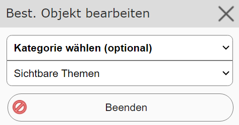
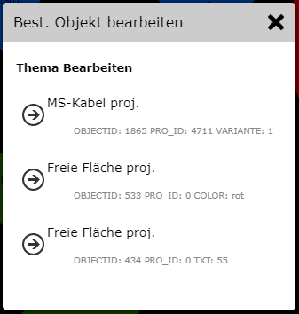
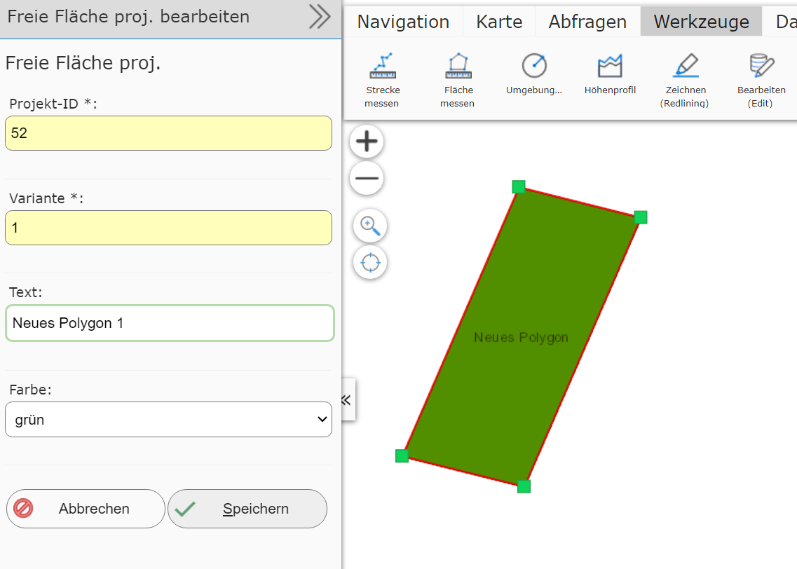

Editing an Existing Object
=============================

Clicking this tool opens the following dialog:

The object to be edited must first be selected (clicked). This dialog can be used to specify
what type of object is involved. If the type is known, you can also use the ``Visible topics`` option. In this case,
the map viewer tries to find an editable object at the location the user clicks on the map.
If it succeeds, the view immediately switches to the corresponding edit form. If a click affects several objects,
an intermediate step still needs to decide what should be edited:

Once the desired object is found, the edit form and an editable geometry sketch are shown on the map:

The attribute data can be changed as desired in the input form. On the map, the sketch can be edited with the sketch tools:

* moving, deleting existing vertices
* inserting additional vertices
* adding further segments

(the description of the sketch tools is covered in its own chapter)

After making changes, the object can be saved with ``Save``. Editing can be ended/canceled at any time with ``Finish``.
Afterwards, you return to the ``Edit an existing object`` form and can click to edit further objects.

The ``Finish`` button, or closing the tool dialog, ends the (sub)tool.

