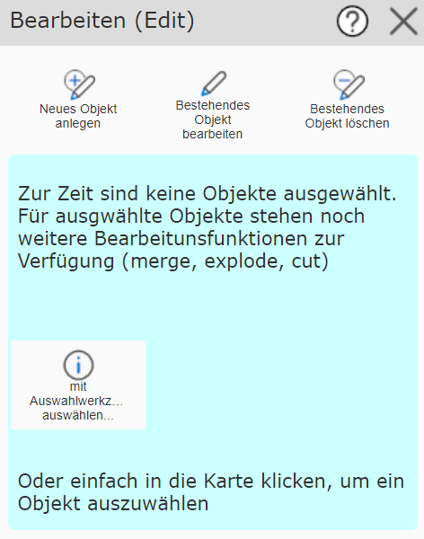

.. _edit_mobile:

Editing in Mobile Layout
========================

Opening the *Editing (Edit)* tool opens the following dialog:

There are different methods for editing an object. If the corresponding geo-objects have, for example, already
been selected via a query, they can be edited directly here. These 'shortcuts' will be described later.
To understand the editing options, we will first cover the three standard methods *creating objects*,
*editing an object*, and *deleting objects*. The individual processes can be started via the corresponding
button in the tool dialog.

.. toctree::
   :maxdepth: 2

   edit_create
   edit_update
   edit_delete
   edit_undo
   edit_selection
