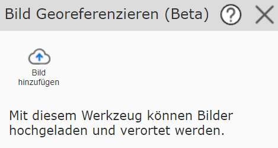
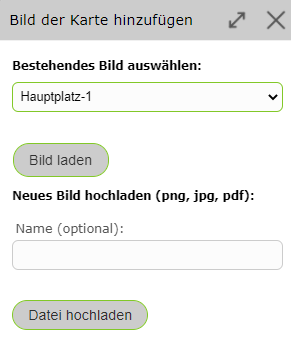
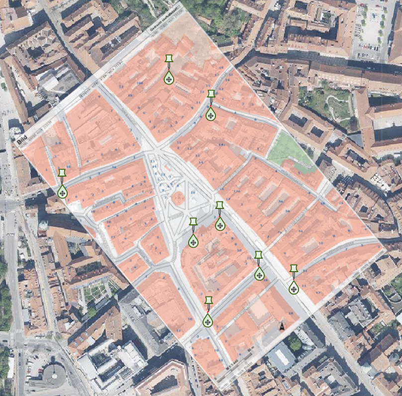
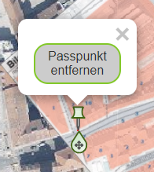
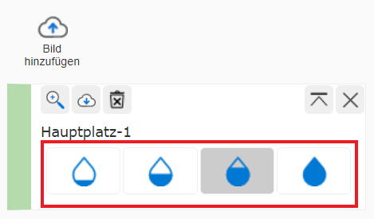
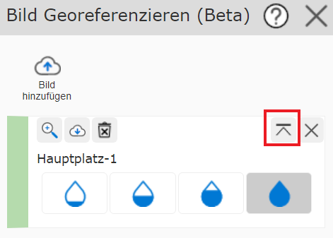
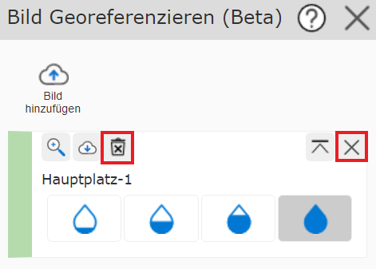
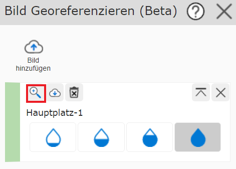
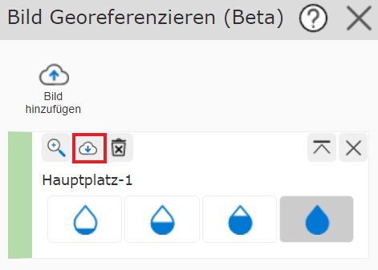
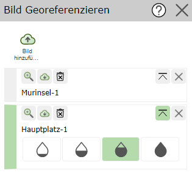

Georeferencing Images
=======================

With the *georeference image* tool, images in PNG, JPG, or PDF format can be uploaded and geolocated.

Adding an Image
---------------

To do this, an image must first be added via *Add image*.

You can either use images that already exist, if images were already uploaded previously, or upload new images.
Uploaded images are stored for the user indefinitely.

Georeferencing an Image
-----------------------

To georeference the added image, the image must be set as active (green side bar).

A control point is set by simply clicking on the map. The *pin* icon shows the control point on the image, and the marker shows the control point on the map. The icons can be moved and adjusted as often as desired.

Clicking on a pin allows that control point to be deleted again with **Remove control point**.

.. note:: Georeferencing works best when control points are set at the edge of the image.
    For example, you can start by setting the most distinctive points of the image in the middle, then work iteratively outward, removing the inner control points again.

Changing Transparency
---------------------

The transparency of the image can be changed with the water drop icons on the side. This makes it easier to identify distinctive points on the map or in the image.

Changing Image Order
----------------------

The following button can be used to move the corresponding image to the very top. This is helpful when several images have been loaded at one location.

Deleting Images
---------------

The *X* icon can be used to remove images from the map. The *trash can* icon permanently deletes the image for the user.

Zooming to an Image
-------------------

The *magnifying glass* icon can be used to zoom to the corresponding image.

Downloading an Image
--------------------

The *download* icon can be used to download the image with a world file in the desired coordinate system as a ZIP folder. Optionally, the world file can also be downloaded with control points.
The control points can then be loaded back into WebGIS.

Setting an Image Active
-----------------------

Clicking on the side bar lets you set images as active. The control points that are set always relate to the active image.

