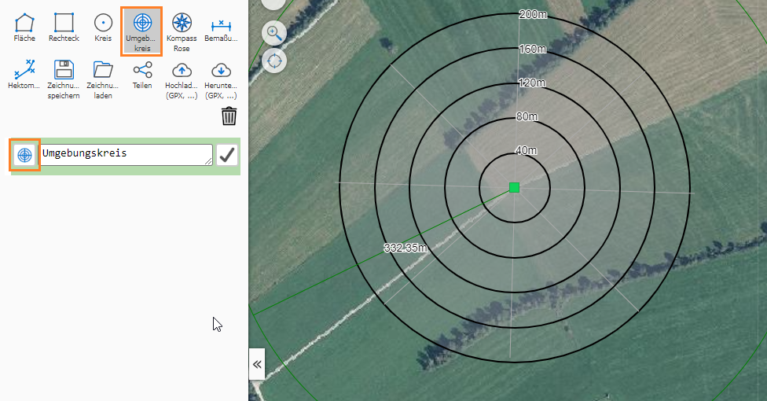
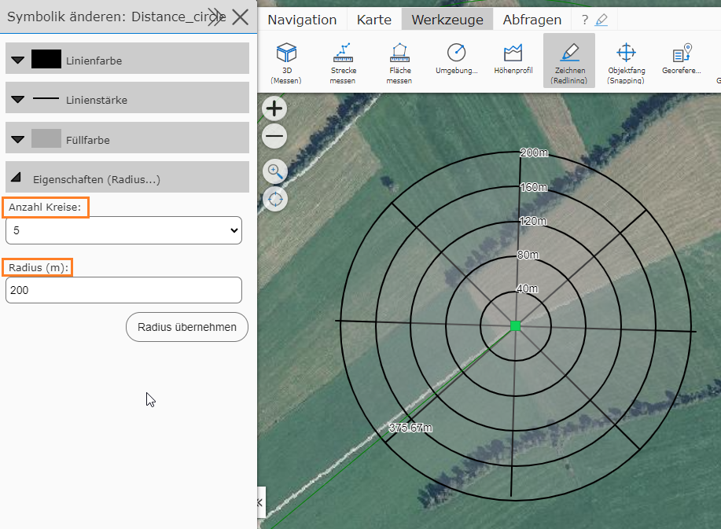
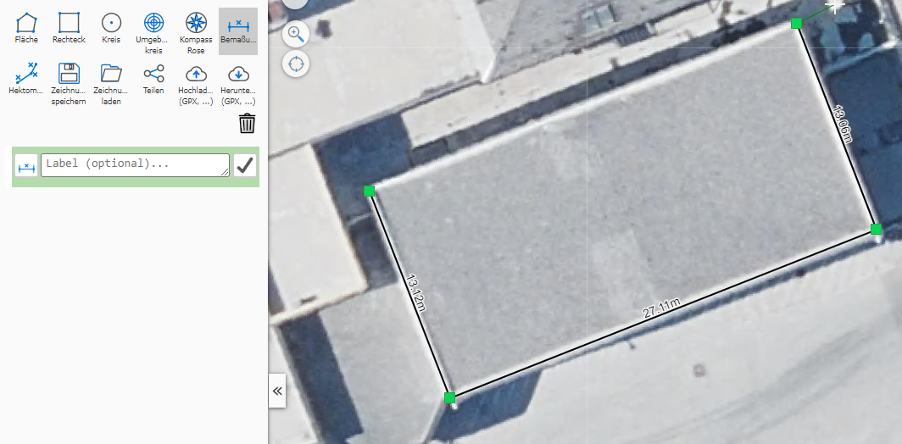
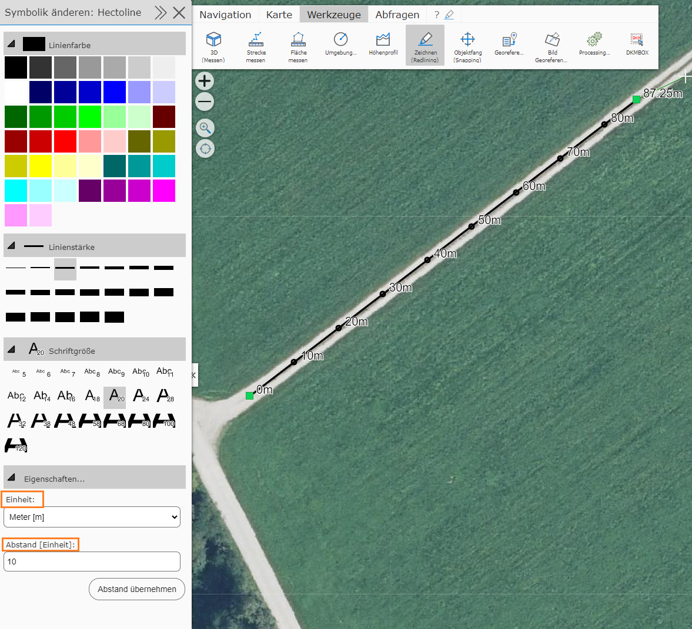
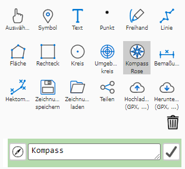
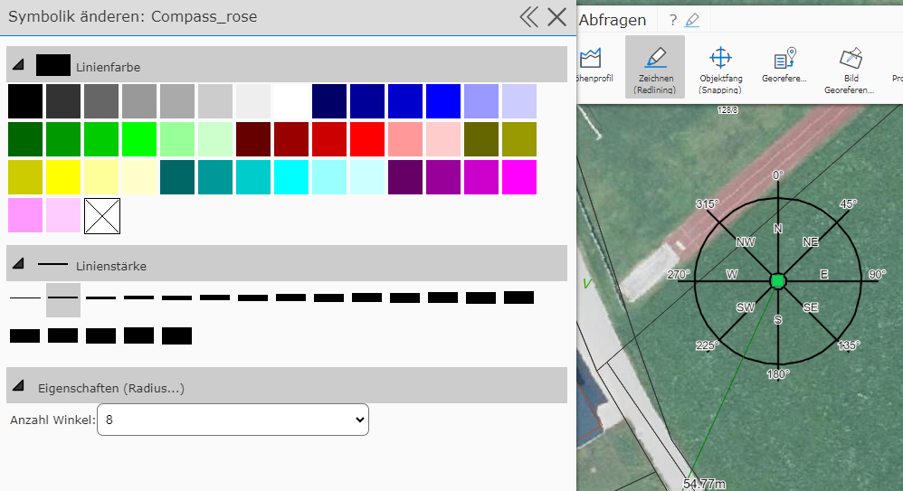

Special Tools
================

In addition to lines, polygons, freehand, text, rectangles, and circles, there are also more specialized graphics, which are covered here.

Buffer Circle
--------------

With this tool, a circle with a certain radius around a center point can be defined. In addition to the actual buffer circle, circles with intermediate steps are also shown and labeled:

The result can be used for distance analyses.

Dimension Line
--------------

With this tool, a (poly)line can be drawn, in which each segment is labeled with its corresponding length in meters:

.. note::
   The length shown is always calculated *live* from the vertices in the current map coordinate system. If you transfer the drawing (by saving and loading) into a map with a different coordinate system,
   the values may differ. This applies particularly to all maps that use *WebMercator*, since there can be significant distortion here. Which coordinate system is used can be read
   at the bottom left of the *map viewer*.

   .. image:: img/advanced-tools3.png

Chainage Line
---------------------

With this line, intermediate points are marked and labeled at a predefined distance (e.g. every 100m):

Meters [m] and kilometers [km] can be specified as the display unit.

.. note::
   Just as with the dimension line, the distance points here are also calculated *live* and always relate to the current map coordinate system. If you insert the drawing into different maps, deviations may occur!

Compass
-------

A new addition to map markup is the *compass* special tool.

If you insert one, you have the option under *Edit symbology* to adjust the color, line thickness, and number of angles accordingly.

