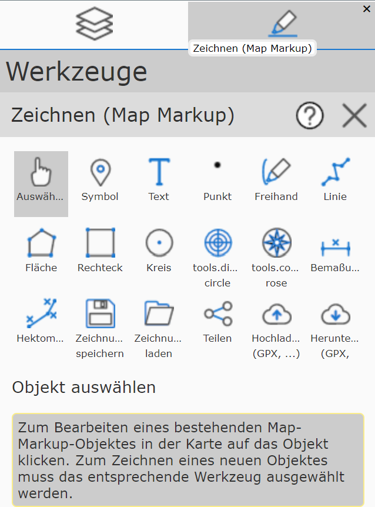
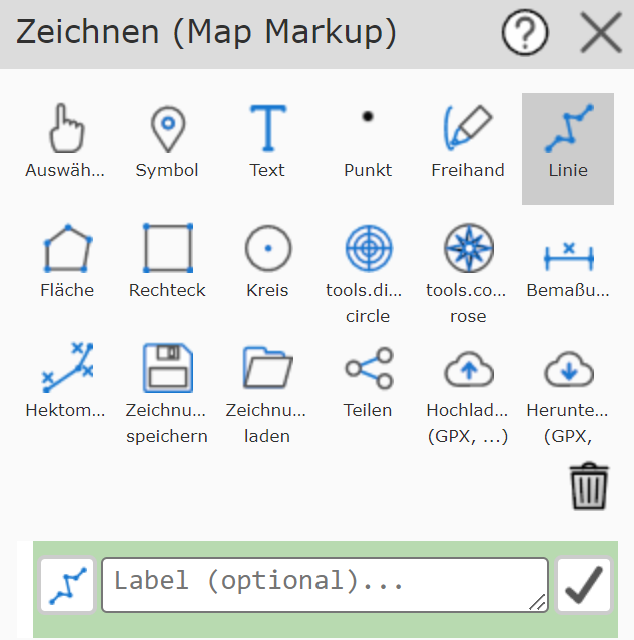
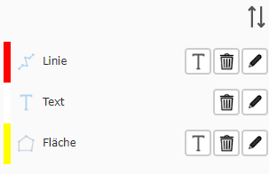
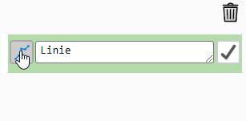
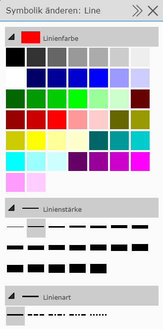
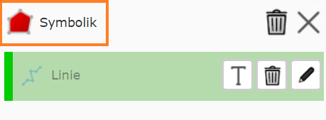

Using the Drawing (Map Markup) Tool
========================================

General Usage
--------------------

The drawing (map markup) tool is actually a collection of (sub-)tools that make it possible
to graphically augment the content of the map.
After opening the tool, the drawing (map markup) dialog is shown.
It offers all possible drawing tools.
In addition, there are buttons for managing drawings (load, save, share, upload, download).

The buttons may vary depending on the end device. The figure shows all tools (desktop).
Below the buttons, the name of the currently active drawing tool is shown again, along with a *yellow*-highlighted
description of how to use this tool (e.g. click on the map, click on an existing drawing element, etc.).

Because of this description, the exact click sequence for the individual drawing tools is not covered here in detail;
instead, the options and differences between the tools are shown.

Drawing a New Element
----------------------

If you create a new element (for example, a line), you must define at least two vertices by clicking on the map.
Once the line is recognized as valid (at least two vertices), it can be *applied* to the map.
Until it is *applied*, the draft sketch with the vertices is still shown. As long as the draft sketch is shown,
the line can still be changed:

* Draw further vertices

* Move vertices with the mouse

* Undo steps via the draft context menu (right mouse button)

* Change the presentation via the presentation options

That a drawn element is *valid* and can be applied to the map can be seen in the tool dialog.
As soon as, for example, two vertices have been set for a line, the following button appears in the tool
dialog:

The drawing element is applied to the map with the button showing a checkmark icon. After applying, another line can be drawn right away.
Before applying a drawing element to the map, a description can optionally be specified.
For example, if the line describes a route, you could enter ``Directions to ...`` here.
Descriptions for drawing elements are optional, but help to identify and interpret the element later.

**Tip:** there are further ways to apply a drawing element to the map and draw another one:

* Finishing a draft with a double-click. Afterwards, you can immediately continue drawing an element of the same type.

* Changing the drawing tool: if you draw a line and then want to continue, for example, by drawing a polygon, it is enough to click on the *polygon* tool. A valid line is then automatically applied.

* Labeling a drawing element: in the *Apply* dialog shown above, a *T* (for text) is shown to the right of the input field. This switches to the text tool and allows the current element to be labeled (e.g. length of a line - see below)

Drawing elements already applied are shown not only on the map, but also as a list at the very bottom of the tool dialog:

The icon indicates what type of element it is (line, polygon, text, ...). In addition, there is
a *delete button* (trash can), an *edit button* (pencil), and, depending on the type, a *T button* (text - label, see below).

Changing Symbology
^^^^^^^^^^^^^^^^^^

To change the symbology of the respective object, there is an icon to the left of the description (this icon differs depending on the object).

Clicking it takes you to the menu for making changes to the symbology.
If you select the line tool, for example, the following presentation options are available:

Normally, the option menus for color, line thickness, and line style are already expanded. To change the color of a line, for example, you just need to select it.
The same applies to line thickness and line style (solid, dashed, ...).

These options always relate to the currently active element. If you change a presentation option, the presentation on the map
changes immediately.

.. note::
   If you are drawing a new object, you will only notice the changes once you click on the map to create vertices
   for the element.

Different Behavior of Element Types
--------------------------------------------

The behavior described above is not the same for all element types. Here are a few differences/special cases:

**Symbol:** symbols only require one vertex. After placing the point, it is not necessary to click the
*Apply / Draw another* button; instead, it is enough to click on the map again
to draw another symbol. This allows several symbols to be drawn quickly by simply clicking
on the map (one symbol is placed on the map per click).

**Freehand:** with this tool, a "freehand" line can be drawn while holding down the mouse button. When the
mouse button is released, it is immediately applied to the map. This allows several
freehand lines to be drawn very quickly and conveniently.

**Text:** to place text on the map, after selecting the text tool, click on the map
to set the position of the text. This makes the text position *valid*, and the actual
text can be changed via the text field and via *Apply / Draw another*. A change should be visible on the
map right away. If the position needs to be changed again, this can be done with another click
on the map (or by dragging the insertion point). Clicking the checkmark permanently applies the text
to the map.

Changing an Existing Element
-----------------------------

There are two ways to change an already drawn element.

* Via the *Select* drawing tool (finger): clicking on the object on the map marks the element, which can then be changed.

* Via the list of already existing elements: clicking on an element in the list marks it for editing. The pencil icon can then be used to edit the object.

The second method is practical when several elements overlap and a geographic selection is difficult/impossible.

**Tip:** elements in the list can be identified more easily if they were described before being applied,
since the description is shown in the list.

Once an element has been marked for changing, the draft *sketch* for the element is shown on the map. In addition, a new
*symbology* icon appears above the list, taking you to the menu for editing the presentation.

The draft *sketch* can be used to change the geometry of the element. The presentation can likewise be adjusted via the
presentation options. To finish the changes, you must confirm with the checkmark button to apply them.

Deleting an Existing Element
----------------------------

There are two ways to delete an element:

* Mark the element via the *Select* (finger) tool and click the *delete button* (trash can) to the right of the description input field.

* Click the *delete icon* (trash can) in the list of existing elements.

The advantage of the first method is that you can first see which element is actually being deleted.
If the elements have not been *described*, deleting from the list can result in deleting the wrong element,
because the text shown is not unambiguous.

.. note::
   Deletion is permanent. The drawing (map markup) tool does not offer an **undo**!

Labeling Elements
--------------------

Some element types offer labeling based on certain properties:

* **Lines:** label with the length [m / km] of the line

* **Polygons:** label with the area [m² / km²]

Labeling is done semi-automatically. Only the text value is determined automatically; the positioning of the text
on the map is done by the user.

The procedure for labeling is as follows:

* Click the *T icon* (text) for the corresponding object in the tool dialog.

For the current element, the button is located to the right of the text field for the element's optional description.
Elements already applied to the map show this icon in the list of created elements.

* Click on the map to position the point.

* Optionally change the presentation (font size) or extend/change the text.

* Click *Apply / Draw another* to apply the text to the map.
