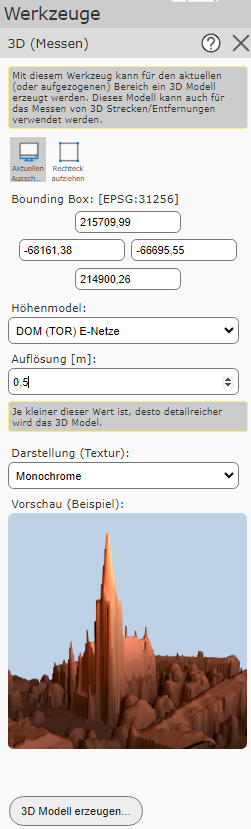
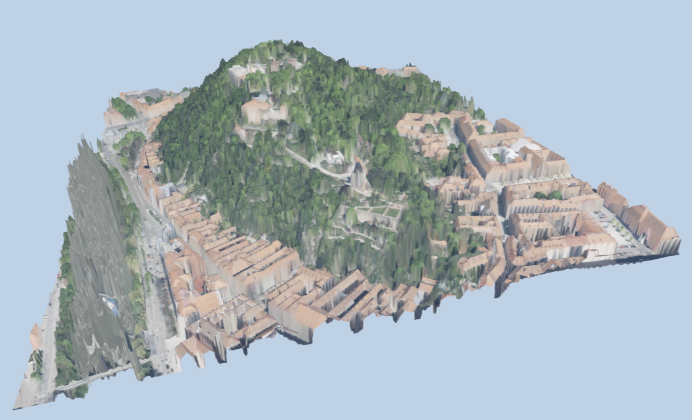
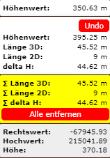
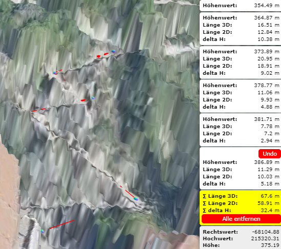

3D Measurement
==============

This tool can be used to create a 3D model, in which measurements can also be performed.

After clicking on the tool, a menu opens in which several settings can be specified.

**Bounding Box**

For this, the area of the 3D model must first be determined. This can be defined either via the current extent or by dragging a rectangle.
Alternatively, the coordinates can also be entered manually.

**Elevation Model**

Under elevation model, the desired elevation model can be selected, on the basis of which the 3D model is created.

**Resolution**

Furthermore, the resolution of the 3D model must be specified.
The best possible resolution, which depends on the size of the extent as well as on the underlying surface model, is already suggested in the field.
If the resolution is chosen too fine, a warning will appear when the 3D model is created.

.. note::
   The larger the bounding box and the finer the resolution, the more extensive the 3D model will be.

**Presentation (Texture)**

Different textures can be selected for the presentation of the 3D model.
The respectively selected texture can then be seen directly in the preview.

``Create 3D Model...`` switches to the selected 3D model.

The following navigation options are available in this view:

* **pan:** to do this, click into the model with the right mouse button and, while holding the mouse button down, move the model. Releasing the mouse button ends the process.

* **zoom:** this can be done using the mouse wheel. Rolling the mouse wheel forward zooms out, and vice versa.

* **rotate:** to do this, click into the model with the left mouse button and, while holding the mouse button down, rotate the model.

At the bottom right is a box with location information for the mouse position.

A vertex is set by simply clicking on the map. If further vertices are set, the length in 2D and 3D as well as the elevation difference between the respective vertices is calculated.

The sum of the lengths, as well as the total elevation difference of all vertices, is shown with a yellow background.

The ``Undo`` button can be used to remove the most recently set vertex. Clicking the ``Remove all`` button removes all vertices.

The 3D model can be closed again via the ``X`` at the top right.
