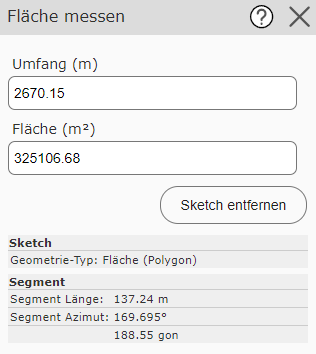

Measure Area
=============

With this tool, a *sketch* (draft polygon) can be drawn.
As soon as the polygon is valid (has at least three vertices), the perimeter in meters and the area in m² are shown in the input fields
in the tool dialog:

The *Remove sketch* button can be used to start a new polygon.
As additional information, the dialog also shows the *sketch information* of the current line segment (length and azimuth).

All the capabilities of the *sketch* tools can be used (construct, snapping, trace, ...).

.. note::
   If the polygon is not valid, the area is shown as 0. A polygon is invalid if it has fewer than three
   vertices, or if individual segments intersect (self-intersecting polygon).
