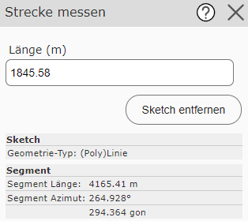

Measure Distance
================

With this tool, a *sketch* (draft line) can be drawn.
As soon as the line is valid (has at least two vertices), the length in meters is shown in the input field
in the tool dialog:

The *Remove sketch* button can be used to start a new line.
As additional information, the dialog also shows the *sketch information* of the current line segment (length and azimuth).

All the capabilities of the *sketch* tools can be used (construct, snapping, trace, ...).
