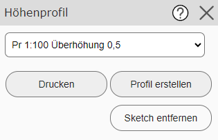
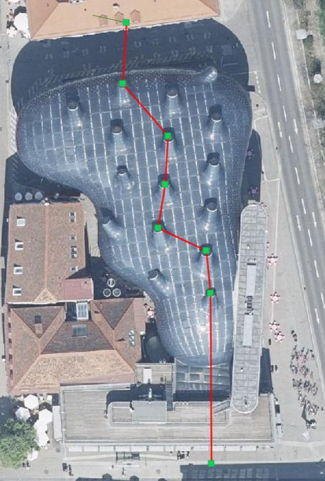
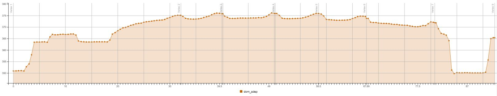
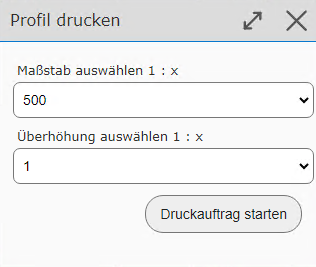
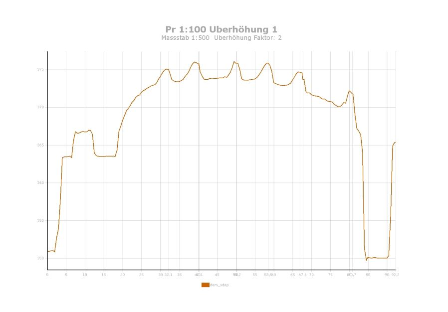

Elevation Profile
=================

With this tool, an elevation profile can be created along a drawn (poly)line.
In the tool dialog, you must specify the case (scale/vertical exaggeration) for which the profile should be created.

.. note::
   The scale generally determines how many intermediate points are queried. For example, if you select
   a very large scale for a very long line, creating the profile can take a very long time,
   because a very large number of intermediate points are then queried. In the worst case, the query is not possible at all.

A line with several intermediate points can now be created on the map.

If you then click Create Profile in the tool dialog, the elevation profile is shown after a short
calculation time:

.. note::
   If the profile is too "imprecise" (has too few intermediate points), the profile type can be changed and the profile recreated.

.. note::
   The elevation profile shown in the viewer is interactive. If you move the mouse over one of the *elevation points*, the
   elevation is shown as a tooltip. At the same time, a marker is shown at the corresponding point on the map, on the drawn
   profile line.

The profile can also be output as a PDF via the *Print* button in the tool dialog.
A dialog then appears once more, in which the target scale and the exact vertical exaggeration of the profile can be
specified:

Once the PDF file has been created successfully, a preview appears in the print jobs dialog, and the elevation profile can be
downloaded:

