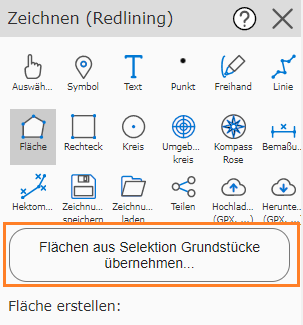
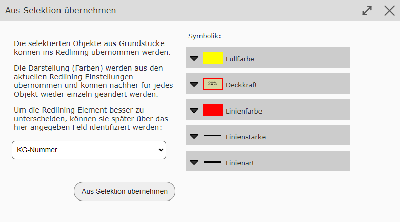
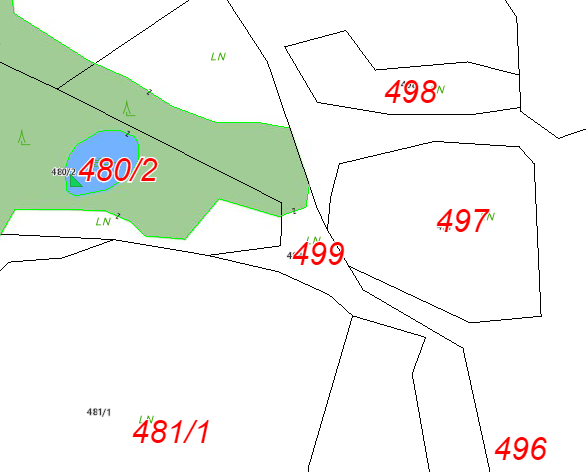
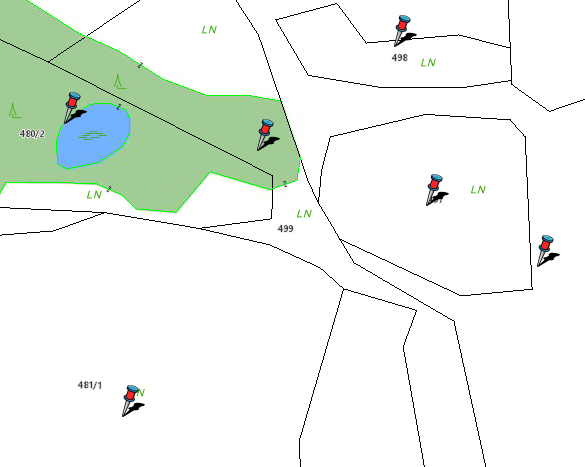

Transferring Elements from a Selection into Redlining
=====================================================

Depending on permissions, it is possible to take the geometry for redlining elements from an existing query/selection.
Use cases for this include, for example:

* Showing the selection of several queries at the same time, coloring them individually, and printing them

* Simplifying the retracing of already existing geometries from a query

* Transferring text from queried objects to the map

.. note::
   Whether this function is available is determined by the operator of the map viewer. It may also only be offered in a restricted form.
   For example, it can be restricted how many objects may be transferred, or whether a download of these elements is possible.

Procedure
--------------

For this function to be offered, objects must first be queried. This is done as described in the *Search and Query* section, or with the *Identify/Select* tool.

.. note::
   The query results must appear **selected** on the map (with a *cyan* background). Otherwise, they will not be recognized by the *drawing (redlining)* tool.
   Query results are selected when the corresponding option has been set in the result list:

   .. image:: img/selection1.png

Switching to the *drawing (redlining)* tool allows you to transfer these objects. First, note the geometry type (point, line, polygon) of the selected query results.
Points, for example, *cannot* be transferred as lines or polygons.

For example, if you have selected parcel areas, you can also select the *polygons* sub-tool in the *drawing (redlining)* tool. The following button should now appear in the tool dialog:

Clicking this button shows the following dialog:

Here you can select an attribute from the query results, whose values should be used as a description when inserting the objects into the redlining. This makes it easier later to identify the graphic elements
in the list. The possible attribute values depend on the query topic.
For parcel areas, for example, the *parcel number* is a good choice.

.. note::
   The presentation (colors, ...) of the inserted elements depends on the current presentation options. These can be changed afterwards, but each element must then be edited separately.
   It is therefore recommended to set the correct presentation options before transferring.

Once all settings are correct, the objects can be converted into drawing elements with the *Transfer from selection* button.

Forms of Transfer
--------------------

As already shown, polygon objects can be converted into *polygon* drawing elements. The same applies to lines and points (which can be transferred as symbols).
In addition, all objects can be transferred as text. The following list shows which object geometries can be converted into which drawing elements.

+-----------------------------------------------------+----------------------------------------------------------------+
| **Object Geometry**                                 | **Drawing (Redlining) Geometry**                               |
+-----------------------------------------------------+----------------------------------------------------------------+
| Points                                              | * Symbols                                                      |
|                                                     | * Text                                                         |
+-----------------------------------------------------+----------------------------------------------------------------+
| Lines                                               | * Symbols                                                      |
|                                                     | * Text                                                         |
|                                                     | * Lines                                                        |
+-----------------------------------------------------+----------------------------------------------------------------+
| Polygons                                            | * Symbols                                                      |
|                                                     | * Text                                                         |
|                                                     | * Polygons                                                     |
+-----------------------------------------------------+----------------------------------------------------------------+

It seems understandable that points can be converted into both symbols and text (the insertion point is always the location of the object point).
Nevertheless, it can also make sense to convert lines and polygons into symbols or text. When converting lines and polygons into symbols or text, the insertion point is automatically calculated
so that it lies on the respective object.

One use case might be, for example, if the parcel number for the selected query results should be shown in a specific form for a printout.
The procedure for this would be as follows:

* Select parcel areas via search or query

* Switch to the *drawing (redlining)* tool

* Click on the text sub-tool

* Set presentation options (font size and color)

* Click the *Transfer texts from selection of parcel areas...* button.

* In the dialog, select *parcel numbers* as the description field, and confirm with the *Transfer from selection* button

* Optionally further adjust or reposition the individual resulting text elements

* Optionally, the selected query results can be removed from the map; the drawing elements remain

The result could then look something like this (red text elements are drawing elements and come from a query).

In the same way, you could also add a marker to the selected parcels. To do this, in the *drawing (redlining)* tool, select the *symbol* sub-tool instead of *text*, and
click the *Transfer symbols from selection of parcel areas...* button.

