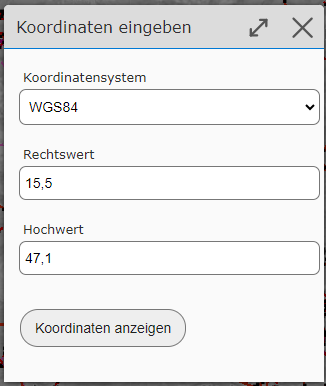
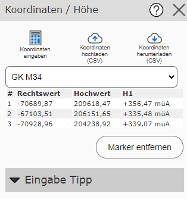
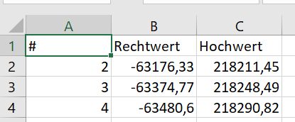
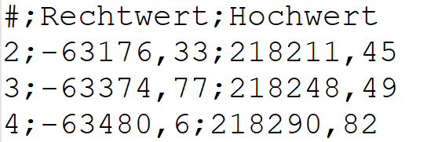

Coordinates
===========

Entering and Querying Coordinates
---------------------------------

With the *Query Coordinates* tool, coordinates can be queried by clicking on the map,
as well as entered and displayed.

.. note::
   **Tip:** The tool can not only be opened via the toolbox, but also opens
   when you click on the running coordinates in the map viewer:

   .. image:: img/coords1.png

If you want to jump to a specific coordinate, this is done via the *Enter Coordinates* sub-tool.
Beforehand, it is also recommended to expand the *Input Tips* once, where different input options
for geographic and projected coordinates are shown.

Coordinates are entered in the following dialog:

In the selection list, a coordinate system must first be selected, and then the easting and
northing values entered in the input fields. Confirming the dialog with *Show Coordinate* changes the map view
to the desired position and a marker is shown.

.. note::
   **Tip:** If you just want to jump to a point with known geographic coordinates, you can also
   enter the coordinates in the quick search (see the *Search and Query* section).

Markers can also be created by clicking on the map. If the map viewer is used on desktop,
the coordinates are shown in a list view in the tool dialog:

In the selection list above the coordinate list, a coordinate system can be chosen. The coordinates in the list
are shown in the coordinate system selected here.

.. note::
   In addition to XY coordinates, the coordinates tool also shows elevations.

With the *Remove Markers* button, all markers disappear from the map, along with the entries in the list.

Downloading Coordinates
-------------------------

The list of coordinates can be downloaded as a CSV file. The *Download Coordinates (CSV)* sub-tool
is used for this. The coordinates are downloaded in the coordinate system
currently selected for the coordinate list. So the list is downloaded exactly as it is shown in the
tool dialog (including elevation values).

CSV is a text file that can be opened in any text editor. Spreadsheet
programs such as MS Excel can also usually handle this file:

Uploading Coordinates
---------------------

A coordinate list can also be uploaded. The data must likewise be provided as a CSV
file (the separator must be a semicolon; either a comma or a period is accepted as the decimal point):

When uploading, the coordinate system in which the coordinates are provided must first be specified in a dialog.
The file can then be uploaded.

If the upload is successful, the coordinates are marked on the map with markers and shown as a coordinate list
in the tool dialog.

.. note::
   The elevations are also always redetermined for each coordinate.

Projecting (Converting) Coordinates
-----------------------------------

With the methods shown above, it is also possible to convert coordinate lists from one coordinate system into another.
The prerequisite is that the desired coordinate systems are offered by the map viewer.

The procedure is as follows:

* Upload a coordinate list as CSV

* Check in the map whether all coordinates were uploaded correctly. If the position there is not correct, the wrong coordinate system was probably specified during upload.

* In the tool dialog for the coordinate list, select the desired target coordinate system

* Download the coordinates in CSV format
