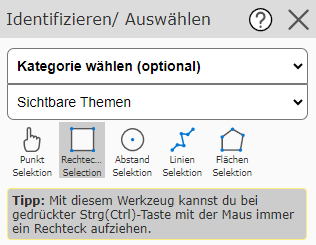
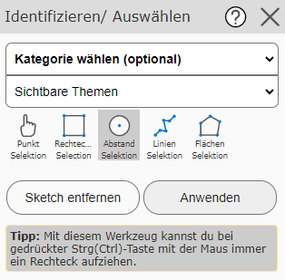
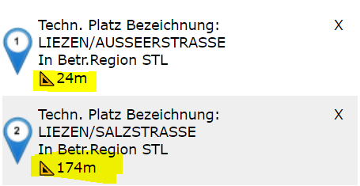

Identify/Select
========================

The *Search and Query* section already covered how geodata can be queried with the map viewer
and how the results should be interpreted and handled.
The *Standard* tool was used there as the query tool, which allows geo-objects to be queried simply by
clicking on the map. For certain use cases, however, further query options are
needed, which this tool provides.

.. note::
   The difference from querying with the *Standard* tool is that with this tool, the
   queried objects are immediately **selected** (shown with a cyan background).

Another difference from the *Standard* tool is that here you can select in advance in the selection list
which topic should be queried. If you do not want to commit to a specific topic, you can also
choose the option ``Visible Topics`` (all topic layers currently switched on) or ``All Topics`` (additionally all
topics that could theoretically be switched on and made visible at the current map scale).

.. note::
   If a map contains a very large number of topic layers, querying across all topics may take a few
   moments. In addition, in this case, in the event of ambiguity, you must decide on the
   desired topic in an intermediate step (see the *Search and Query* section).
   Querying a specific topic usually returns a result immediately.

The *Identify/Select* tool offers the following sub-tools:

Point Selection
---------------

This allows objects to be queried by simply clicking on the map. Apart from the difference
that the queried objects are immediately selected, this tool corresponds to querying with
the *Standard* tool.

Rectangle Selection
-------------------

This sub-tool is selected by default as soon as the *Identify/Select* tool is selected from the
toolbox.

With this, a rectangular window can be dragged open on the map while holding down the mouse button. The query
is applied to all objects located within the window.

Circle Selection
----------------

With this sub-tool, a circle can be drawn, within which the query should take place.
To do this, you must first click on the map to define the center point of the circle. If you then
move the mouse, a preview for the circle is already shown, including the radius value.
A further click is needed to set the radius. If the radius is not optimal, the circle can still be changed by
another click.

The entire circle can be removed with the *Remove Sketch* button.
If the query circle fits, the query can be carried out with the *Apply* button:

If a query is done via a circle, there are two special features in the results:

* The **sorting** of the results is done by the distance of the queried object from the center of the circle.

* The **distance** to the center of the circle is shown in the results.

Line Selection
----------------

Here a line can be drawn. Once the line is finished, the query can be started with the *Apply*
button, just as with *Circle Selection*. All objects that intersect the
drawn line are queried here.

Area Selection
-----------------

The function of this sub-tool corresponds to that of the *Line Selection* tool. However, an
area is drawn here, and the objects under this area are queried.
