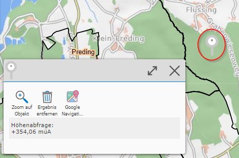

Query Elevation Model
=====================

If the *Query Elevation Model* tool is selected, elevations can be queried by simply clicking on the map.

.. note:: Only individual measurements are ever taken, and the result is shown directly at the bottom left of the screen (desktop version).
    If the queried elevations need to be saved or downloaded, the *Coordinates* query tool must be used.

* **Zoom to Object:** Zooms to the current object.

* **Remove Result:** Removes the current result.

* **Google Navigation:** Redirects to *Google Maps*, where a route can be calculated and started.

Clicking on already placed markers shows the result again.

Using the ``Remove Markers`` button, all placed markers can be removed again.
