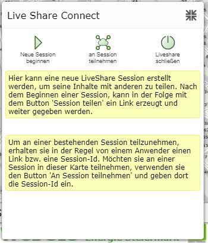
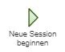
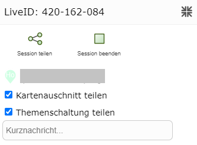
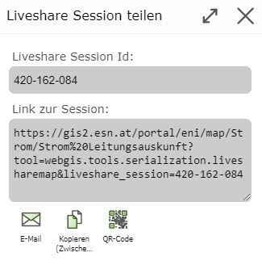
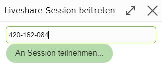
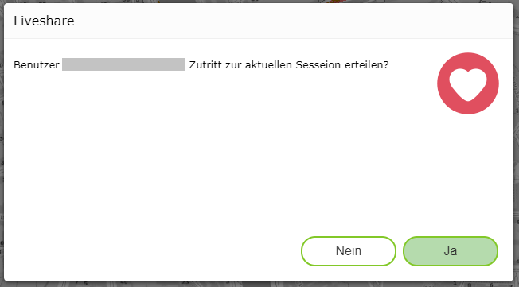
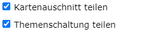
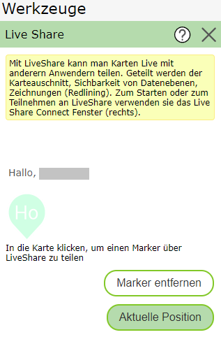
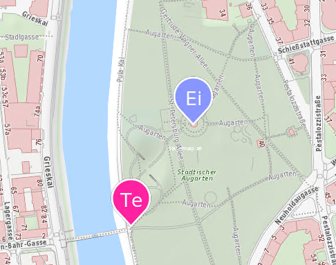

Procedure
=========

Clicking on the *Live Share* tool opens the following window:

Starting a New Session
----------------------

First, the session owner must start a new session.

After starting the session, a window opens offering ways to share the session.

In addition, an info window for the current LiveShare session appears at the bottom right.

Sharing a Session
-----------------

There are various ways to share the LiveShare session:

* **LiveShare session ID:** If you want to join the session via the LiveShare tool. (However, this requires access to a WebGIS map in which the LiveShare tool is available. This is not needed for the other access options.)

* **Email:** Opens the email program, which can then be used to send the access link.

* **Copy (clipboard):** The access link is copied to the clipboard.

* **QR code:** Creates a QR code that contains the access link. This allows easy access via phone.

* **Facebook:** Redirects to Facebook.

* **Twitter:** Redirects to Twitter.

Joining a Session
---------------------

If a participant opens any of the available options, they are asked whether they want to join the LiveShare session:

The session owner is then asked to confirm each new participant:

Active LiveShare Session
------------------------

What can be done with the LiveShare tool was already explained in more detail in the previous section. The new options are described here.

* **Sharing map view/topic switching**

If *Share map view* is selected, the same map view is shown in all sessions.
If *Share topic switching* is selected, the same topics are shown in all sessions.

* **Setting a marker**

Each session participant can set their own marker. To do this, they simply need to click on the map.
Using ``Current Position``, the marker can also be set to the current position.
The marker can be removed again with ``Remove Marker``.

Ending a Session
----------------

Using *End Session*, the owner can end the LiveShare session.

Leaving a Session
-----------------

Using *Leave Session*, participants can exit the LiveShare session. This does not end the session.
