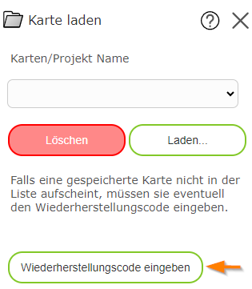

Loading a Map
=============

With this tool, you can load saved maps again. The following are generally loaded:

* Map view

* Visible topic layers

* Drawings created with the *Drawing (Redlining)* tool

.. note::
   **Note:** as already explained for the *Save Map* tool, the presentation of a map
   may change from time to time. This also changes the presentation of saved maps!

In the tool dialog, an assigned map name can be entered. Clicking in the field shows suggestions
to help find the correct project. Saved maps always relate to a user, which means
saved maps belonging to another user cannot be loaded.

Loading a Map as an Anonymous User
----------------------------------

As already described for the *Save Map* tool, ideally the user should be known when
saving a map, so that the map can be assigned to the correct user again.

If the map viewer is offered on the internet, access is generally anonymous. When saving,
a recovery code is therefore generated, which is stored in the browser and archived by the user.

If you switch browsers (or clear the browser cache from time to time) or devices, the
recovery code must be entered again. This can be done both in the *Save Map* and
in the *Load Map* dialog:

Further notes on the recovery code are given in the description of the *Save Map* tool.
