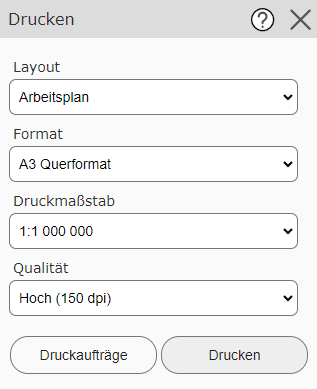
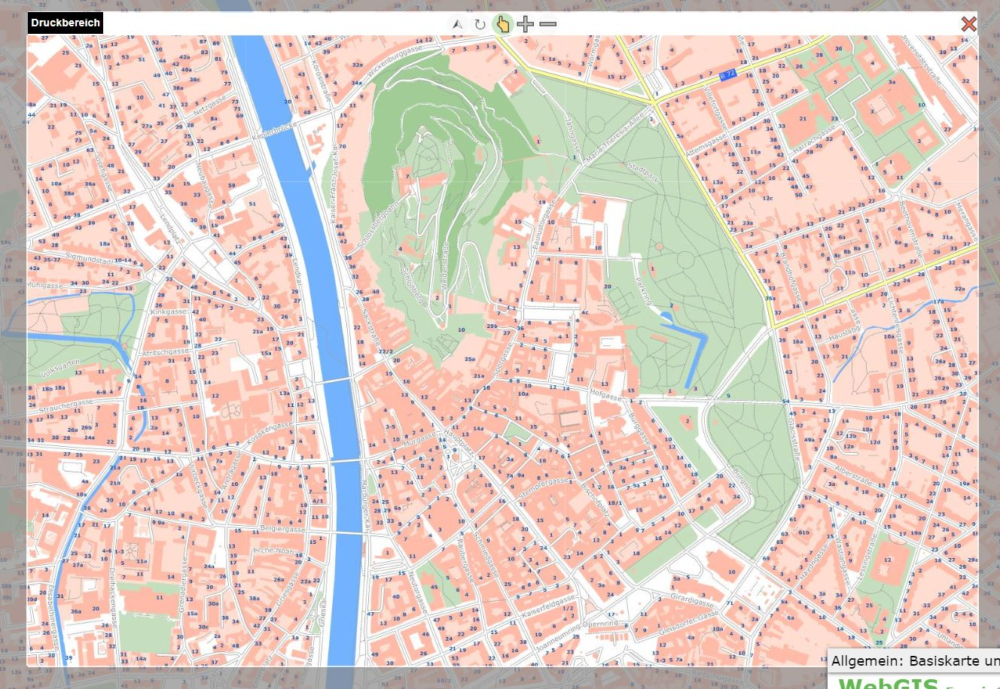
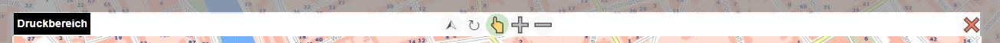
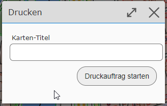
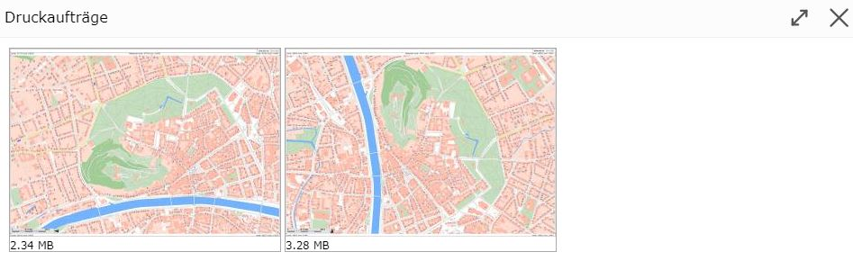

Printing
========

With this tool, map views can be printed to scale or downloaded as PDF files.
In the PDF, the map is additionally embedded in a special layout, which can contain additional information such as a north arrow,
legend, copyright notices, coordinate ticks, etc.

Various print settings can be made via the tool dialog. The possible values for these settings
are defined by the map author:

* **Layout:** There are different layouts, which can be defined by the map author. The final layout is only visible later in the printout and, depending on the definition, contains a title, north arrow, legal notices, etc.
* **Format:** Specifies the (paper) size and orientation of the printed map.
* **Scale:** The printout can only be done at predefined scales.
* **Quality:** Defines the quality of the map. The higher the DPI value, the higher the quality of the printout. However, it should also be noted that this also increases the size of the PDF file.

When the print tool is selected, the map view also changes. A "lens" is placed over the map here,
marking the area that will later be printed.

The map can be moved with the mouse so that the desired view fits into the "lens". If you change the
print layout or the format/orientation, the "lens" changes automatically as well.

.. note::
   With the print tool, the map can only be panned. Changing the scale (zooming) is no longer possible with the
   usual methods. The scale can be set via the selection list in the tool dialog (or the lens buttons,
   see below).
   The reason for this is that the scales for the screen display do not necessarily match the possible print
   scales.

Above the "lens" that marks the print area, there are a few buttons that affect operation.
These buttons are described here from right to left:

* **Close (X):** With this button, you can close the "lens" and leave the print tool again.
* **Zoom In (-):** With this button, the print scale is decreased (serves as a shortcut, so that the print scale selection list does not necessarily need to be used).
* **Zoom Out (+):** With this button, the print scale is increased.
* **Pan (hand icon):** If this tool is selected, the map area can be panned.
* **Rotate (rotation icon):** If this tool is selected, the lens can be rotated while holding down the mouse button. To do this, hold down the left mouse button and move the mouse around the center of the map.
* **North (arrow icon):** Clicking this button orients the "lens" back to north.

.. note::
   If you rotate the lens, the printed map is no longer oriented to north. The top edge of the printed map corresponds
   to the edge of the lens with the text "Print Area".

.. note::
   **Note on scale limits:** Some topics are only shown in the map at certain scales.
   However, when determining the area via the "lens," the map cannot be displayed at this scale,
   since screen and paper size are generally not identical. In addition, print scales and
   map scales for the screen may differ. Generally, for the display of the lens,
   the map is shown on the screen at a smaller scale. Therefore, in this view, not
   all topics that will nevertheless end up in the printout may be visible.
   **Note:** the display here is chosen in such a way that defining the view is possible.
   The content in the printout depends on the respective print scale.

Once the view has been correctly set via the lens, the printout can be started with the ``Print`` button in the tool dialog.
This first shows a dialog in which some further details about the printout can be entered (which
details can be entered here depends on the respective print layout).

Once the print job is started and completed successfully, the print preview opens with all maps
created in the current session:

From here, the maps can be downloaded and printed by *clicking* on them.

.. note::
   The print preview can also be opened afterwards via the corresponding button in the *Print* tool dialog.
   Printouts from other tools (e.g. elevation profile) are shown there as well.

.. note::
   The print preview is only retained within the session. After restarting the viewer, the maps
   in the preview disappear. It can also happen that the created PDF documents are deleted again on the
   server after a certain time. PDF documents should ideally be saved locally or printed
   right after they are created.
