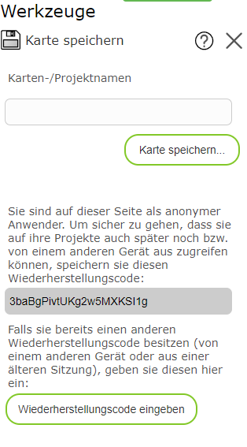

Saving a Map
===============

With this tool, a map can be saved and reopened at a later time.
The following map characteristics are saved:

* Map view

* Visible topic layers

* Drawings created with the *Drawing (Map Markup)* tool.

.. note::
   The save tool does not guarantee that the map can be retrieved 1:1 forever.
   Since the underlying map services can change from time to time (topic layers are
   added, removed, or renamed, the presentation is changed, etc.), the map
   may theoretically appear changed when opened again later. If you want to save a map image
   unchangeably, you can also create a printout as PDF (see the *Print* tool).

Clicking on the tool opens a dialog in which a name can be assigned to the map.
The map can be loaded again later using this name.

.. note::
   If the name has already been used, the *old* map is overwritten without confirmation and
   replaced by the current one.

.. note::
   Saved maps are only visible to the user who saved them. The names for
   saved maps only need to be unique per user.

Saving a Map as an Anonymous User
-------------------------------------

Saving the map requires that a user can be recognized again in a later session,
in order to be able to reopen the drawings. For intranet applications, this generally happens automatically via
the login to the company network. For anonymous access from the internet, a
note appears when saving, to restore sessions at a later time. The note reads roughly as follows:

It is important here that the recovery code is saved somewhere after first use.
(For example, you can copy the recovery code from the text field and paste it into a text file or email
to archive it.)
The recovery code is generally stored in the browser, but it can also be lost by
clearing the browser cache. In this case, you can enter an archived recovery code
here (and later also in the *Load Map* dialog) in order to retrieve your maps again.

.. note::
   The recovery code is also needed if the browser or the device (desktop, tablet, phone)
   is changed.

.. note::
   If you make the recovery code available to other users, they can open all of your
   maps and theoretically also overwrite them. So do not pass on the recovery code,
   and instead use the *Share Map* tool to *share* maps.
