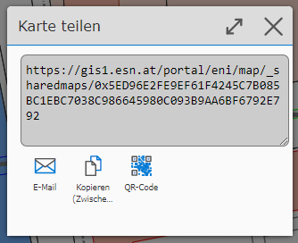

Sharing a Map
=============

With the *Save Map* and *Load Map* tools, maps can always only be managed by the same user.
If you want to share a map with other users, this tool helps.

The following are shared:

* Map view

* Visible topic layers

* Drawings created with the *Drawing (Redlining)* tool

After opening the tool, a dialog appears in which you can specify how long the sharing of the map
should be valid. Sharing maps should only be temporary and not serve the purpose of permanently
storing maps. In addition, as already explained for the *Save Map* tool, it cannot be guaranteed
that the map will still appear the same after a longer period of time.

Therefore, in the first dialog, select how long (1 day, 1 week, 1 month) the shared map
should remain valid.

In the next step, a dialog appears with the generated link:

The generated link can, via the tools offered,

* be sent by email (email program opens)

* be copied to the clipboard

* be shown as a QR code

QR codes are practical when the target device is a phone. These can generally scan QR codes with the
camera and then automatically open the linked address. This makes it easy, for example, to transfer a map that is already
open on desktop to a mobile device.
