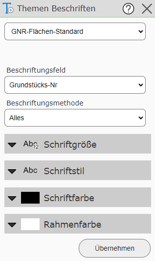
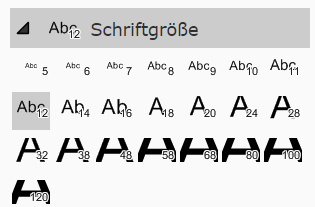
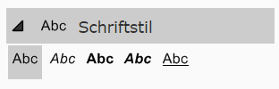
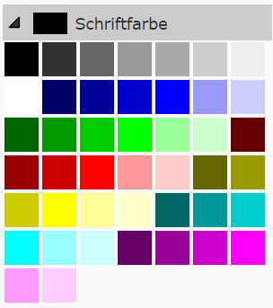
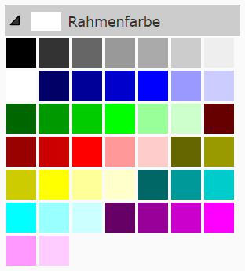

Labeling Topics
==================

With this tool, topics can additionally be labeled.

To do this, you must first select the topic that should be labeled.
Depending on the topic, the possible label fields defined by the map author are then offered.

The labeling method determines how often an object should be labeled:

* **All:** Every object is labeled, and larger objects are labeled more often.

* **1x per name:** If several objects have the same label, only one of them is labeled.

* **1x per object:** Every object is labeled only once. This may result in fewer labels being shown overall. This is generally not recommended for long line objects or large polygon objects.

In addition, the style can also be defined. The following settings are available for this:

With ``Apply``, the chosen label is set, and it can be removed again with ``Remove``.

Any number of further labels can be set. To remove a previously set label, the corresponding topic must be selected and then the ``Remove`` button that appears must be clicked.
