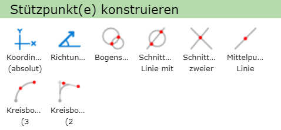
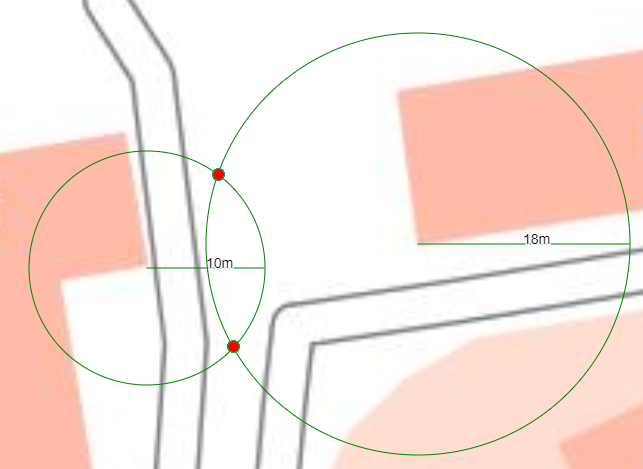
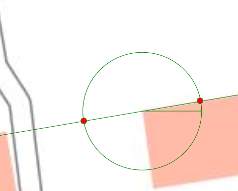
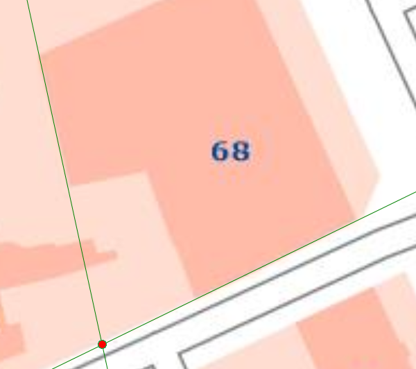
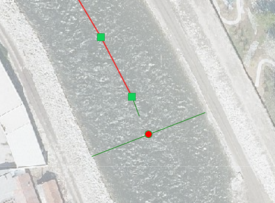
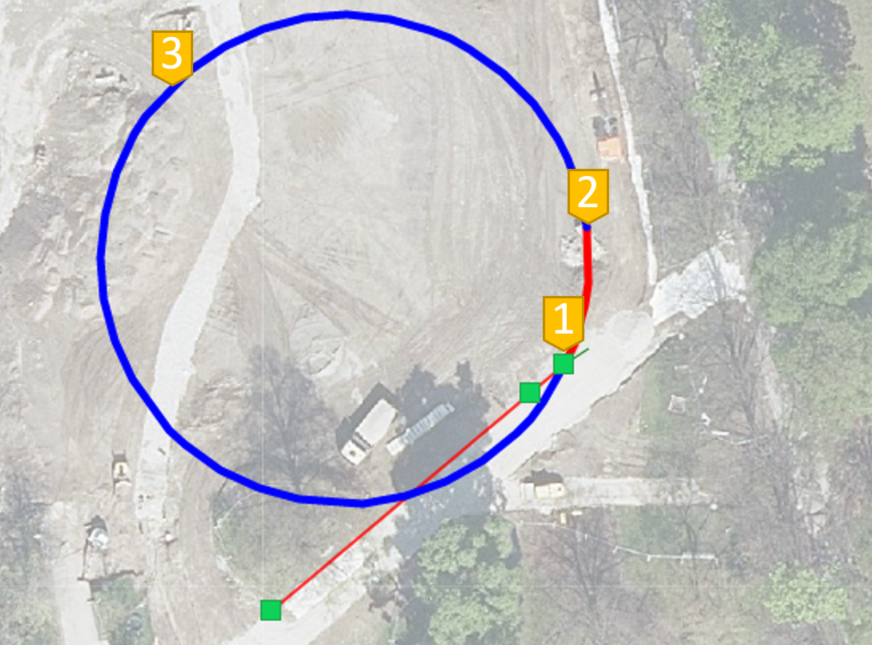
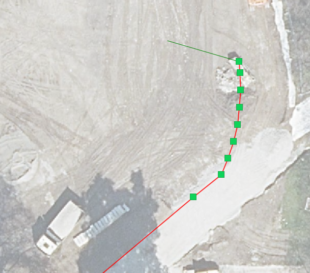
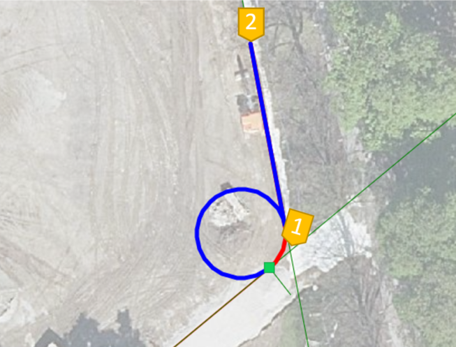
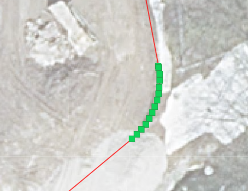
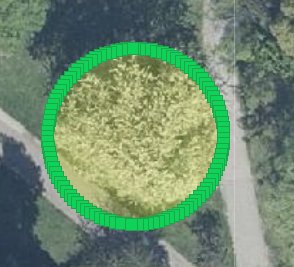

Constructing Vertices
==========================

New vertices can also be constructed using the following methods. To access the menu, right-click on the map or on a vertex.

Construction mode can be canceled at any time with another right-click.

Coordinates
-----------

With the *Coordinates (absolute)* option, the next vertex can be set using absolute coordinates.
Selecting this function opens the following window:

.. image:: img/coordinates1.png

Here you must first select the corresponding coordinate system and then enter the easting and northing values.
The coordinates of the point where the right-click was made are already entered in the field, in the map's coordinate system.
With ``Apply Coordinate``, the new vertex is set.

Direction/Distance
-------------------

With *Direction/Distance*, the next vertex can be determined via direction and distance relative to the previous vertex.

.. image:: img/sketch3.png

The values already entered in the fields relate to the position of the right-click and can be manually changed as desired.

Arc Intersection
----------------

With an *arc intersection*, 2 auxiliary circles with arbitrary radii can be drawn, which is especially suitable for use cases where 2 distances are known. To do this, you must first click on the map to define the center point of the first circle. Then either the circle can be dragged with the mouse, or the exact radius can be entered by right-clicking.
The second circle is created in the same way. The two intersection points of the circles are then marked in red and can be selected to set the new vertex.

Line-Circle Intersection
----------------------------

With *Line-Circle Intersection*, the new vertex can be created using a line and a circle. This is especially useful for cases where a direction and a distance are known. To do this, the line must first be drawn with 2 support points. Then the circle is constructed by first clicking on the map for the center point, and then either dragging the circle with the mouse or, if the radius is precisely known, entering the value directly via a right-click.
Finally, the new vertex can be chosen from the (usually two) resulting intersection points.

Intersection of Two Lines
--------------------------

With *Intersection of Two Lines*, two auxiliary lines can be drawn. The resulting intersection point can then be selected as the new vertex.

Line Midpoint
-----------------

With *Line Midpoint*, a vertex can be placed at the midpoint of a newly constructed line. To do this, only the start and end points of the auxiliary line need to be drawn. The resulting midpoint can then be selected as a vertex.

Arc (3 Points)
---------------------

*Arc (3 Points)* allows an arc to be created using 3 points, requiring the following 3 steps.

1. Set the start point of the arc
2. Set the end point of the arc
3. Set the 3rd point, which determines the size of the arc

This creates a circle from which the desired arc (blue or red) must be chosen.

The created arc (in this case the red part) then consists of several segments.

Arc (2 Tangents)
------------------------

With the *Arc (2 Tangents)* function, an arc can be defined using 2 tangents. The first tangent represents the extension of the most recently set line segment. Therefore, a line segment must already exist for this tool.
The second tangent can then be placed by setting 2 points, where the 2nd point also corresponds to the end of the new segment.

Constructing a Circle
---------------------

To construct a circle in the area tool, you must first set the center point. Then you can select *Construct Circle* from the right-click menu. This allows a circle to be dragged out, or a fixed distance can be entered as the circle's radius via another mouse click.

Constructing a Rectangle
------------------------

Similar to the circle, a rectangle can also be constructed by selecting *Construct Rectangle* from the right-click menu after setting the first corner point. This allows a rectangle to be dragged out, or the length and width can be entered via a right-click.

The created rectangle can then still be rotated or moved.
