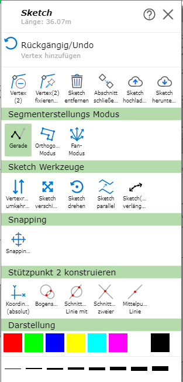
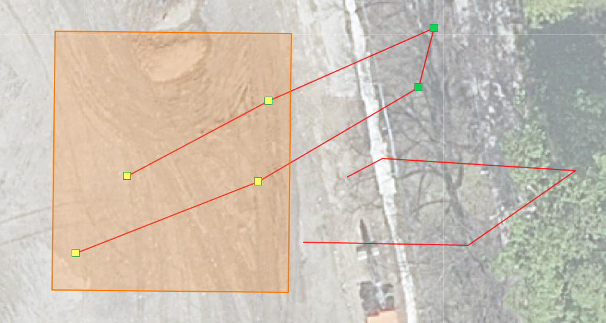
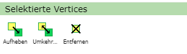

Sketch/Drafting Tools
========================

When drawing a sketch (e.g. when redlining, editing, creating an elevation profile, ...), several options are available that can be very helpful depending on the application.

To access them, right-click on the sketch or on the map while drawing. Depending on the type of the sketch (line, polygon), the following options are offered:

.. note::
   On (mobile) devices with touch operation, clicking on the map works via the *Click Bubble* tool (see the *Click Bubble* section under Tools).
   The advantage of *Click Bubble* is that it avoids accidental clicks while navigating and offers higher precision when clicking.

Undo
---------------

With ``Undo``, the last commands, which are shown in gray under *Undo*, can be undone.

.. note:: There is no *Redo*.

Editing Vertices
-----------------

Vertices are the so-called support points of the line, which can be edited afterward in various ways.

* **Move vertex:** Click on the vertex and drag it to the desired position while holding down the mouse button.

* **Add vertex:** There are several ways to do this: click on the map, use *Direction/Distance* (see below), or use *Coordinates (absolute)* (see Construct).

* **Add vertex on an existing line:** Right-click on the line and then select *Add Vertex*.

* **Remove vertex:** Right-click on the vertex and then select *Remove Vertex*.

* **Fix/anchor vertex:** Right-click on the vertex and then select *Fix/Anchor Vertex*. These vertices then remain fixed when moving and shifting, and are shown as larger blue points. With a right-click and then *Remove Fixing*, the vertex's fixing can be removed again.

Shortcuts
---------

+------------+------------------------------------------------------------------------------------+
| ``A``      | Set a new vertex on a line segment                                                 |
+------------+------------------------------------------------------------------------------------+
| ``D``      | Delete vertex: hold down the ``D`` key and select vertices to delete               |
+------------+------------------------------------------------------------------------------------+
| ``O``      | Activates/deactivates orthogonal mode                                              |
+------------+------------------------------------------------------------------------------------+
| ``T``      | Activates/deactivates trace mode                                                   |
+------------+------------------------------------------------------------------------------------+
| ``S``      | Show snapping dialog                                                               |
+------------+------------------------------------------------------------------------------------+
| ``Ctrl+Z`` | Undo                                                                               |
+------------+------------------------------------------------------------------------------------+
| ``Ctrl``   | While held down, vertices can be selected (see below)                              |
+------------+------------------------------------------------------------------------------------+

Selecting Vertices
--------------------

With **Ctrl**, several vertices can be selected. To do this, while holding down the ``Ctrl`` key, you can either select several vertices by clicking on them, or drag a rectangle with the mouse, which selects all vertices located within the rectangle.

The following new options then appear in the right-click menu:

* **Clear:** Clears the selection.

* **Invert:** Inverts the selection of vertices.

* **Remove:** Removes all selected vertices.

Removing the Sketch
-------------------

With ``Remove Sketch``, the drawn sketches are removed. If this command was executed unintentionally, the sketches can be restored using ``Undo``.
In most tools, the sketch can also be removed via the ``Remove Sketch`` button on the left side of the menu.

Closing Section/Starting New
----------------------------------

With ``Close Section/Start New``, the current sketch is finished and a new sketch can be started.
This allows several lines/polygons to be drawn.

.. toctree::
   :maxdepth: 2

   segmentmodus
   sketchtools
   snapping
   construct
   presentation
