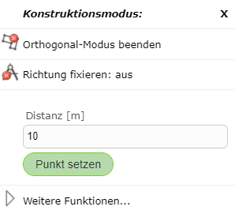
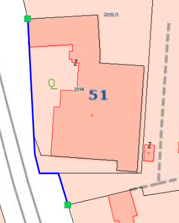

Segment Creation Mode
=========================

Straight
--------

*Straight* represents the default mode. In this mode, new vertices can be set freely without any constraint.

Orthogonal Mode
---------------

Another way to draw right-angled/orthogonal edges is offered by orthogonal mode. In orthogonal mode, any number of orthogonal edges can be drawn.

.. image:: img/orthomodus2.png

If you right-click on the map in orthogonal mode, the following window appears, allowing you to enter a specific distance for the next point relative to the last point set.

Orthogonal mode is ended by right-clicking on the map and selecting *End Orthogonal Mode*.

Trace Mode
-----------

With *trace mode*, snappable edges can be traced.
To do this, right-click on the map and then select *Start Trace Mode* under Segment Creation Mode.
After the first node has been set on an endpoint of the edge, you can move the mouse over nodes of the same topic. The shortest path along the topic's lines is then shown.

In the following example, a line was drawn this way along a parcel boundary.

Trace mode can be ended again by right-clicking on the map and selecting *End Trace Mode*.
