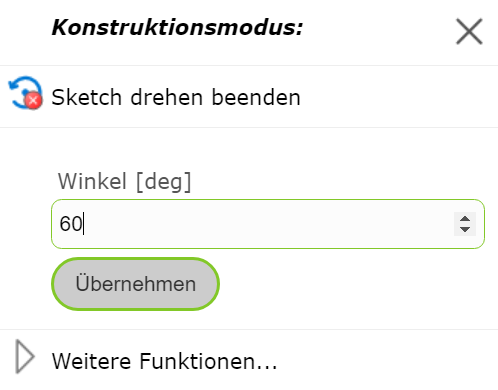
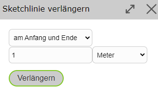

Sketch Tools
================

   .. image:: img/sketch0.png

Reversing Vertex Order
--------------------------

With Reverse Vertex Order, the end point and start point of a line sketch can be swapped. This allows you to continue drawing from the other end of the line.

Moving the Sketch
------------------

If you right-click on a vertex of the sketch, you can move the entire sketch with *Move Sketch*.
An icon then appears, which lets you move the sketch while holding down the mouse button.

.. image:: img/sketch2.png

Rotating the Sketch
-------------------

With *Rotate Sketch*, there are two options: you can either right-click on a vertex or on an edge of the sketch.

* **Vertex:** Here, the reference direction of the rotation angle is set to the coordinate axis pointing east, and the selected vertex becomes the pivot point. This allows the sketch to be rotated by an absolute value.

   .. image:: img/sketch9.png

* **Edge:** Here, the selected edge is assigned to the zero direction pointing east. This allows the sketch to be rotated based on the edge, with the start point of the edge corresponding to the pivot point.

   .. image:: img/sketch8.png

In both cases, an angle value in degrees can also be entered directly via a right-click on the map.

Offsetting the Sketch in Parallel...
------------------------------------

Using *Offset Sketch in Parallel...*, a sketch line can be offset in parallel.
To do this, after a sketch line has been drawn, right-click on the side of the sketch toward which the sketch should be offset in parallel.
A window then opens in which the distance can also be manually adjusted. The distance of the click from the sketch is already entered as the default value in the field.

If certain vertices should not be moved, i.e. should be fixed, the previously described *Fix/Anchor Vertex* function comes into play.
Fixed vertices are not moved.

The functionality is illustrated using the following example (disregarding whether it makes practical sense).
Here, a line sketch was drawn along these parcel boundaries (previously set to snappable).

.. image:: img/snapping7.png

Then, the *Offset Sketch in Parallel...* command was executed on the right side of the line (as seen from the line).

.. image:: img/snapping9.png

To illustrate the fixed points, in the following figure two points were first fixed (marked in blue), and then the same *Offset Sketch in Parallel...* command was executed again.

.. image:: img/snapping8.png

The same principle works analogously for area sketches as well.

Extending a Sketch (Line)
-------------------------

With *Extend Sketch (Line)*, the sketch can be extended at the start, end, or at both the start and end. This tool is only available for lines.

