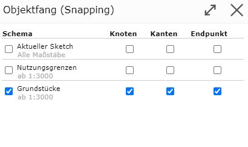
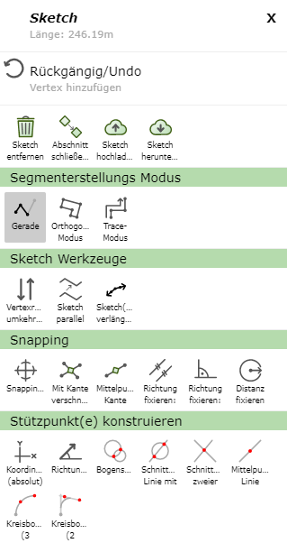
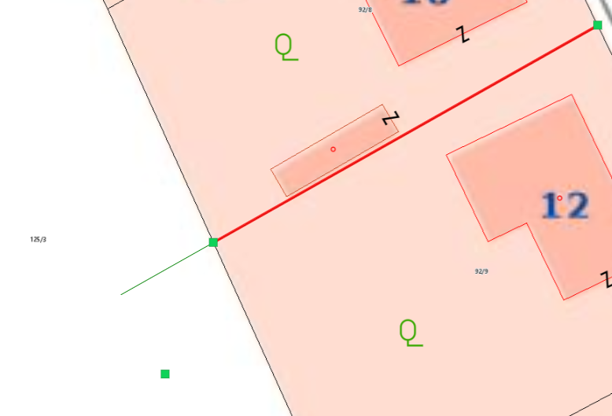
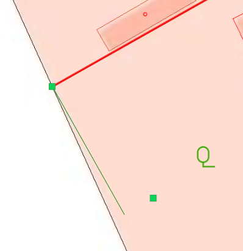

Snapping
========

By right-clicking (whether on the map or on the sketch) and selecting *Snapping ...*, you can choose which scheme object snapping should be activated for.
In addition, you can specify whether only edges, nodes, or endpoints are snappable. Snappable lines are then shown in yellow when you move the mouse near them.

When snapping is activated, further options appear in the menu, which are explained in more detail here.

Intersect with Edge
----------------------

If you have fixed a distance or direction, the *Intersect with Edge* function additionally appears. This allows you to determine the intersection point of a snappable edge and the fixed direction/distance.

Edge Midpoint
-----------------

With this option, the midpoint of a snappable edge can be selected.
To do this, right-click on the corresponding edge and then select *Edge Midpoint*.

Fix Direction: Parallel
---------------------------

With this option, lines can, for example, be extended.
To do this, right-click on the line to be extended and then select *Fix Direction: Parallel*.
This shows the extension of the line in green.

In addition, you can also enter a desired distance for the length of the new parallel edge via another right-click on the map.

.. image:: img/snapping11.png

Fix Direction: Perpendicular
-------------------------------

With this option, similar to *Fix Direction: Parallel*, the new vertex can be positioned perpendicular to the previously set edge.

Fix Distance
----------------

With *Fix Distance*, the distance between the last set vertex and a snappable object can be fixed. Using a green auxiliary line, the next
vertex can be placed at the fixed distance.
This function can be ended again with another right-click followed by *Fix Distance: off*.
