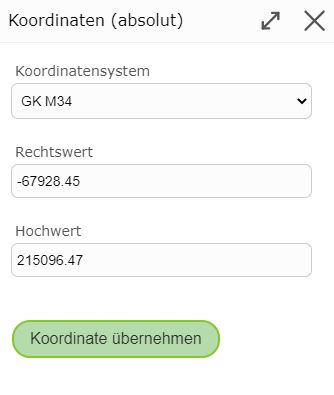

Coordinates
===========

With the *Coordinates (absolute)* option, the next vertex can be set using absolute coordinates.
Selecting this function opens the following window:

Here you must first select the corresponding coordinate system and then enter the easting and northing values.
The coordinates of the point where the right-click was made are already entered in the field, in the map's coordinate system.
With ``Apply Coordinate``, the new vertex is set.
