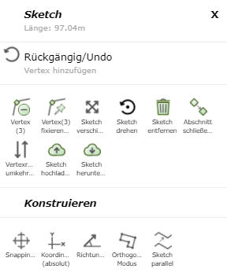
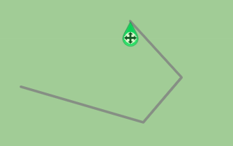
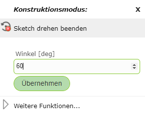
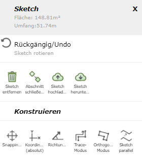
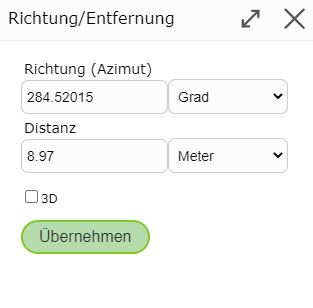

Sketch/Drafting Tools
========================

When drawing a sketch (e.g. when using map markup, editing, creating an elevation profile, ...), several options are available that can be very helpful depending on the application.

To access them, right-click on the sketch or on the map while drawing. Depending on the type of the sketch (line, polygon), the following options are offered:

.. toctree::
   :maxdepth: 2

   construct
   presentation

.. note::
   On (mobile) devices with touch operation, clicking on the map works via the *Click Bubble* tool (see the *Click Bubble* section under Tools).
   The advantage of *Click Bubble* is that it avoids accidental clicks while navigating and offers higher precision when clicking.

Undo
---------------

With ``Undo``, the last commands, which are shown in gray under *Undo*, can be undone.

.. note:: There is no *Redo*.

Editing Vertices
-----------------

Vertices are the so-called support points of the line, which can be edited afterward in various ways.

* **Move vertex:** Click on the vertex and drag it to the desired position while holding down the mouse button.

* **Add vertex:** There are several ways to do this: click on the map, use *Direction/Distance* (see below), or use *Coordinates (absolute)* (see Construct).

* **Add vertex on an existing line:** Right-click on the line and then select *Add Vertex*.

* **Remove vertex:** Right-click on the vertex and then select *Remove Vertex*.

* **Fix/anchor vertex:** Right-click on the vertex and then select *Fix/Anchor Vertex*. These vertices then remain fixed when moving and shifting, and are shown as larger blue points. With a right-click and then *Remove Fixing*, the vertex's fixing can be removed again.

Moving the Sketch
------------------

If you right-click on a vertex of the sketch, you can move the entire sketch with *Move Sketch*.
An icon then appears, which lets you move the sketch while holding down the mouse button.

Rotating the Sketch
-------------------

With *Rotate Sketch*, there are two options: you can either right-click on a vertex or on an edge of the sketch.

* **Vertex:** Here, the reference direction of the angle is set to the coordinate axis pointing east, and the selected vertex becomes the pivot point. This allows the sketch to be rotated by an absolute value.

   .. image:: img/sketch9.png

* **Edge:** Here, the selected edge is assigned to the zero direction pointing east. This allows the sketch to be rotated based on the edge.

   .. image:: img/sketch8.png

An angle value in degrees can also be entered directly via a right-click on the map.

Via *More Functions*, the following menu appears, offering further functions.

Removing the Sketch
-------------------

With ``Remove Sketch``, the drawn sketches are removed. If this command was executed unintentionally, the sketches can be restored using ``Undo``.
In most tools, the sketch can also be removed via the ``Remove Sketch`` button on the left side of the menu.

Closing Section/Starting New
----------------------------------

With ``Close Section/Start New``, the current sketch is finished and a new sketch can be started.
This allows several lines/polygons to be drawn.

Reversing Vertex Order
--------------------------

With Reverse Vertex Order, the end point and start point of a line sketch can be swapped. This allows you to continue drawing from the other end of the line.

Direction/Distance
-------------------

With *Direction/Distance*, the next vertex can be determined via direction and distance relative to the previous vertex.

The values already entered in the fields relate to the position of the right-click and can be manually changed as desired.
