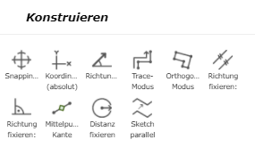
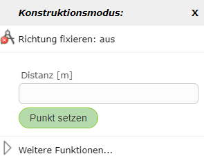
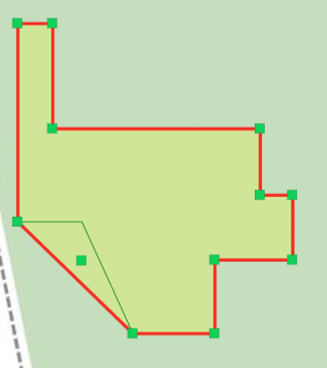
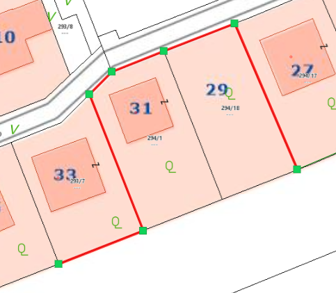
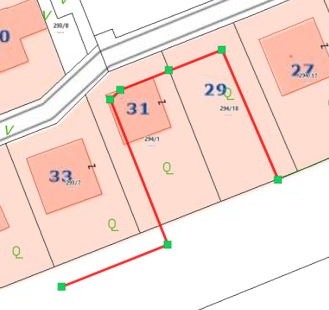
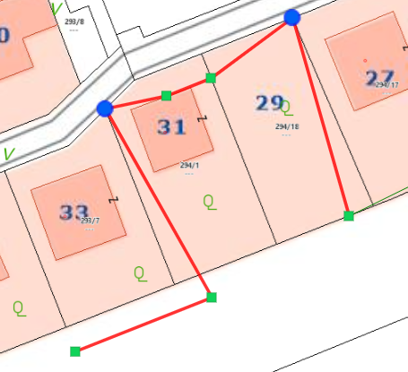

Snapping
========

By right-clicking (whether on the map or on the sketch) and selecting *Snapping ...*, you can choose which scheme object snapping should be activated for.
In addition, you can specify whether only edges, nodes, or endpoints are snappable. Snappable lines are then shown in yellow when you move the mouse near them.

.. image:: img/snapping1.png

When snapping is activated, further options appear under Construct, which are explained in more detail here.

Starting Trace Mode
-------------------

With *trace mode*, snappable edges can be followed.
To do this, right-click on the map and then select *Start Trace Mode*.
After the first node has been set on an endpoint of the edge, you can move the mouse over nodes of the same topic. The shortest path along the topic's lines is then shown.

In the following example, a line was drawn this way along a parcel boundary.

.. image:: img/snapping10.png

Trace mode can be ended again by right-clicking on the map and selecting *End Trace Mode*.

Fix Direction, Parallel
---------------------------

With this option, lines can, for example, be extended.
To do this, right-click on the line to be extended and then select *Fix Direction, Parallel*.
This shows the extension of the line in green.

.. image:: img/snapping3.png

In addition, you can also enter a desired distance for the length of the new parallel edge via another right-click on the map.

Fix Direction, Perpendicular
-------------------------------

With this option, similar to *Fix Direction, Parallel*, the new vertex can be positioned perpendicular to the previously set edge.

.. image:: img/snapping4.png

Orthogonal Mode
---------------

Another way to draw right-angled/orthogonal edges is offered by orthogonal mode. In orthogonal mode, any number of orthogonal edges can be drawn.

If you right-click on the map in orthogonal mode, the following window appears, allowing you to enter a specific distance for the next point relative to the last point set.

.. image:: img/orthomodus1.png

Orthogonal mode is ended by right-clicking on the map and selecting *End Orthogonal Mode*.

Edge Midpoint
-----------------

With this option, the midpoint of a snappable edge can be selected.
To do this, right-click on the corresponding edge and then select *Edge Midpoint*.

Fix Distance
----------------

With *Fix Distance*, the distance between the last set vertex and a snappable object can be fixed. Using a green auxiliary line, the next
vertex can be placed at the fixed distance.
This function can be ended again with another right-click followed by *Fix Distance: off*.

Offsetting the Sketch in Parallel...
------------------------------------

Using *Offset Sketch in Parallel...*, a sketch line can be offset in parallel.
To do this, after a sketch line has been drawn, right-click on the side of the sketch toward which the sketch should be offset in parallel.
A window then opens in which the distance can also be manually adjusted. The distance of the click from the sketch is already entered as the default value in the field.

If certain vertices should not be moved, i.e. should be fixed, the previously described *Fix/Anchor Vertex* function comes into play.
Fixed vertices are not moved.

The functionality is illustrated using the following example (disregarding whether it makes practical sense).
Here, a line sketch was drawn along these parcel boundaries (previously set to snappable).

Then, the *Offset Sketch in Parallel...* command was executed on the right side of the line (as seen from the line).

To illustrate the fixed points, in the following figure two points were first fixed (marked in blue), and then the same *Offset Sketch in Parallel...* command was executed again.

The same principle works analogously for area sketches as well.
