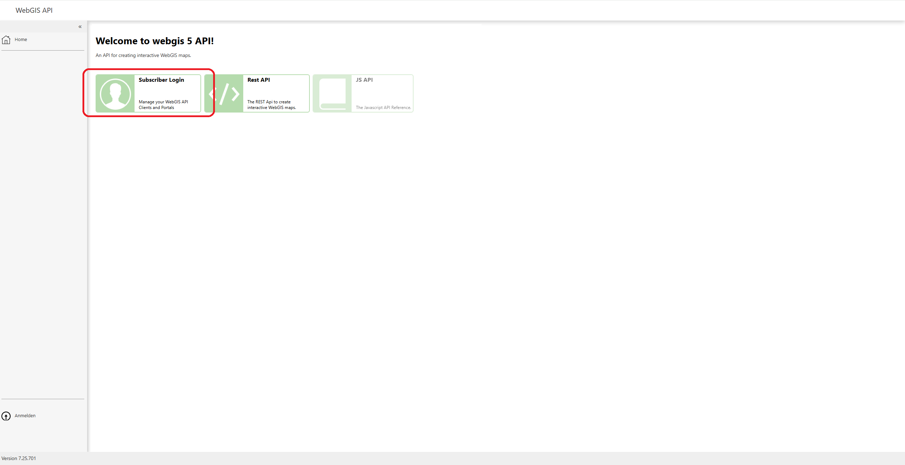
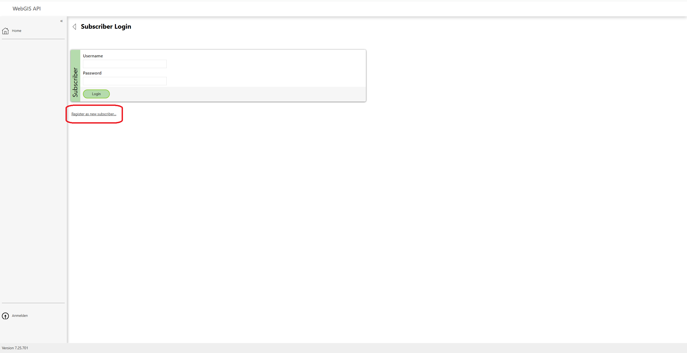
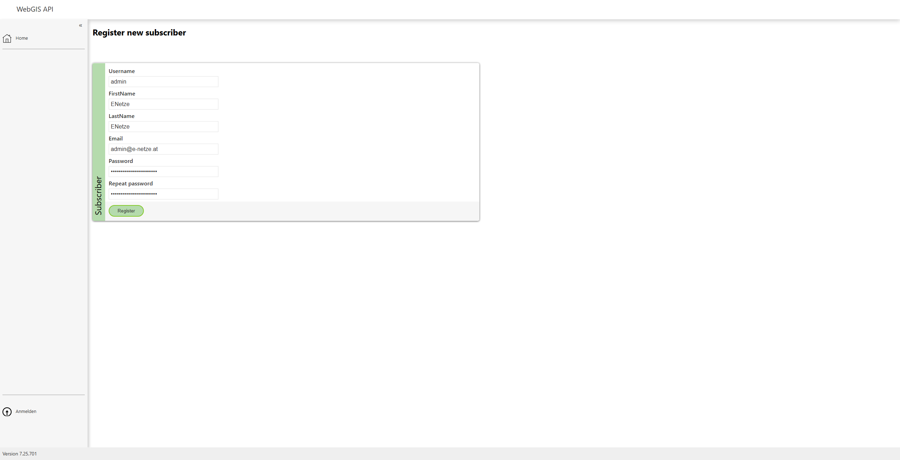
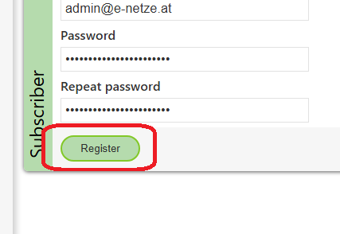
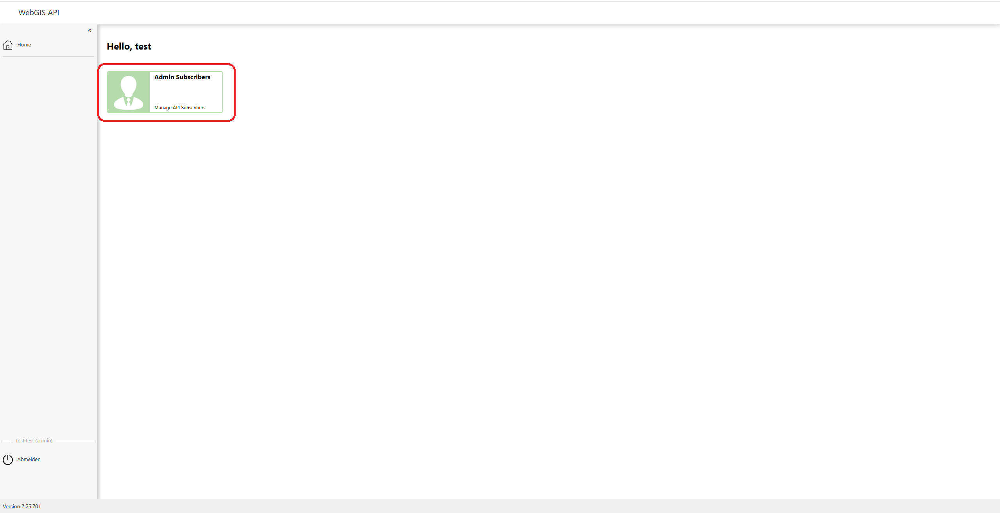
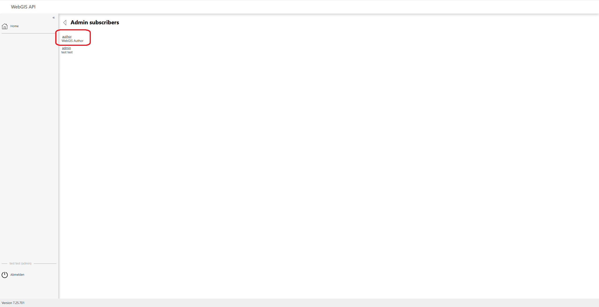
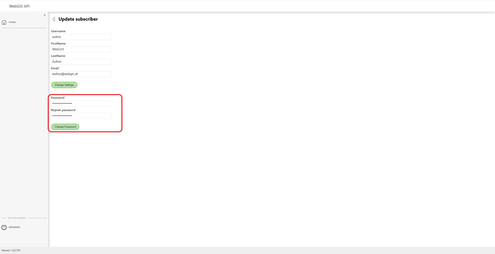

Logging In and First-Time Registration
======================================

After installation and the first time the WebGIS platform is opened, the admin account must be created, since only this user can manage other users. It is also necessary to change the default password of the "author" user to ensure security.

Creating the Admin Account
--------------------------

To create the admin account, click on the **"Subscriber Login"** field.

Registering as a New Subscriber
------------------------------------

Then click **"Register as new subscriber"** to register a new user.

Filling in the Form
-------------------

Fill in the registration form by completing the following fields:
- **Firstname**
- **Lastname**
- **Email**
- **Password** – Make sure to choose a secure password. An example of a secure password would be:

  - At least 12 characters
  - A combination of uppercase and lowercase letters
  - At least one number and one special character (e.g. !, @, #)

The **Username** must be **"admin"** in order to create the admin account for the first time.

Completing Registration
--------------------------

Click the **"Register" button** to register the admin account.

User Management
------------------

After the admin account has been created, you can view and manage a list of all users by clicking **"Admin Subscribers"**.

In the user list, you can see all registered users.

Changing the "author" User's Password
--------------------------------------

Click on the user **"author"** to edit their settings. Change the password to a secure password to ensure security.

Adding a New User
-------------------------

After the admin account has been created, regular users can also be added. To do this, click the **"Register a new user"** button and fill in the form with the desired user data.

