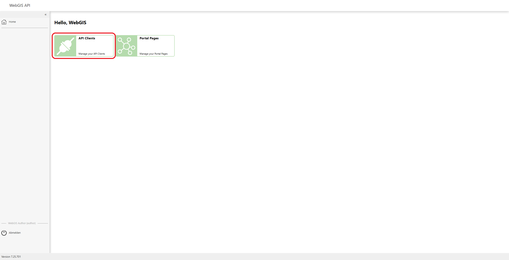
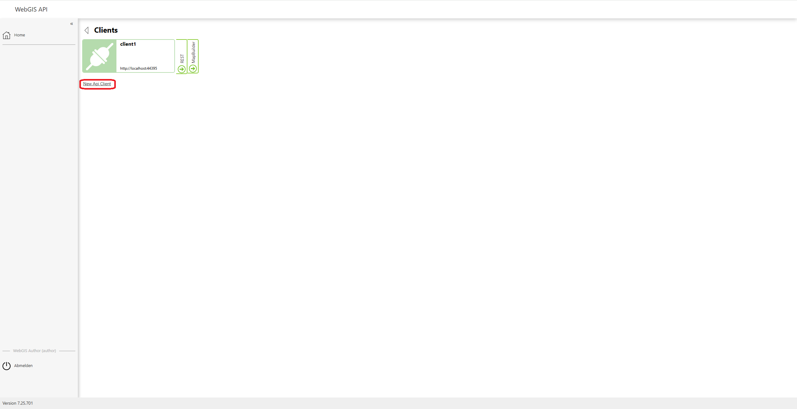
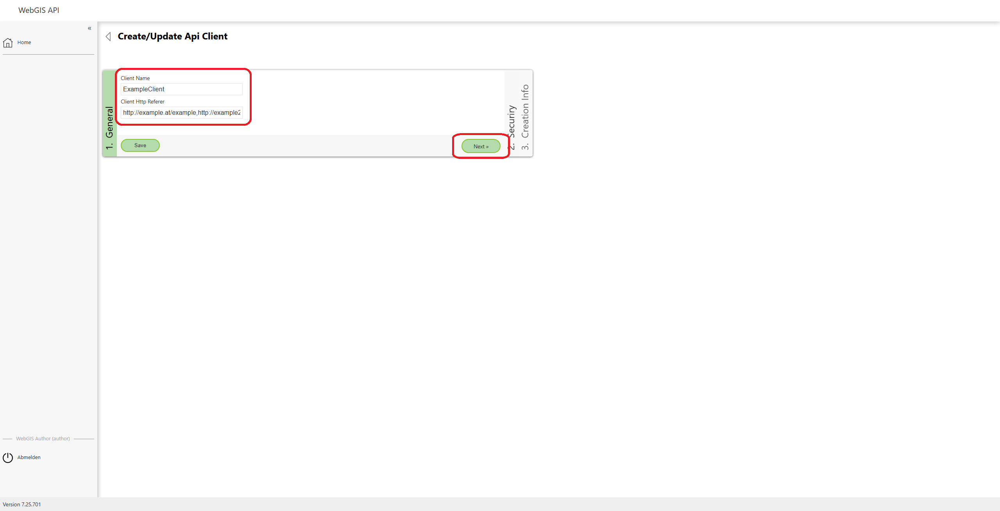
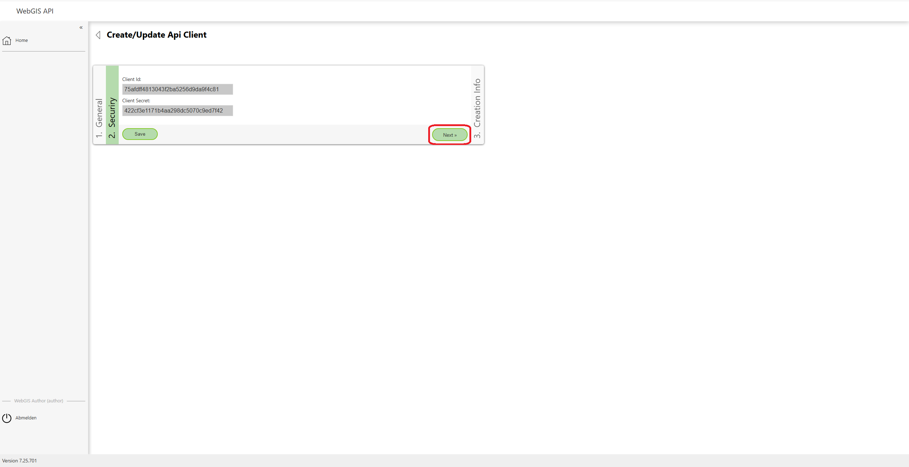
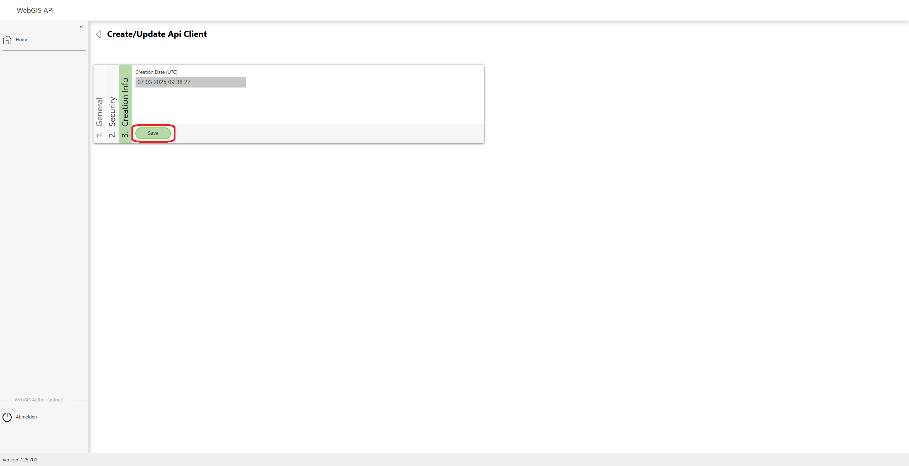
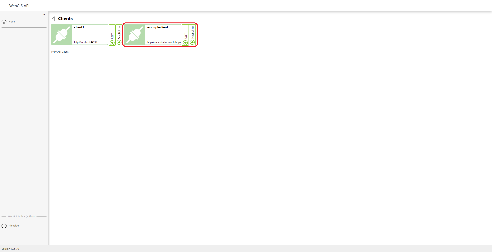

Creating and Managing API Clients
=================================

To manage API clients or create new ones, you must first log in to the **WebGIS API**. After logging in, you can access an overview of the already created clients via the **API Clients** menu item.

API Clients Overview
----------------------

Click the **API Clients** menu item to go to the overview of the already created clients.

In the overview, you see a list of all existing API clients. If you want to edit a specific client, you can simply click on the desired client.

Creating a New API Client
-------------------------

To create a new API client, click the **"New API Client"** button.

Entering General Information
------------------------------

After clicking **New API Client**, a form appears in which you must name the new client. In the **Client Name** field, enter a descriptive name for the API client, and in the **HTTP Referer** field, add the corresponding HTTP referer link.

Click the **"Next"** button to proceed to the **Security** information.

Security Information
------------------------

Under the **Security** section, information such as the **ClientID** and the **Client Secret** is shown. This information is important because it is used to authenticate the API client.

Click **Next** to go to the **Creation Infos**.

Creation Information
------------------------

In the **Creation Infos** section, you can see the exact date and time the API client was created. This information is for display only and cannot be changed.

Clicking the **"Save"** button creates the API client and completes the creation process.

Editing an API Client
---------------------

If you want to edit an existing API client, for example to change the **Client Name** or the **HTTP Referer**, simply click on the desired client in the overview.

You can change or supplement the fields as needed. Once you have made your changes, click **"Save"** again to apply the changes.
