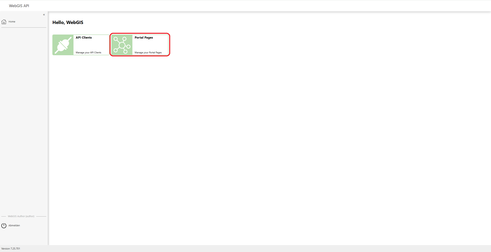
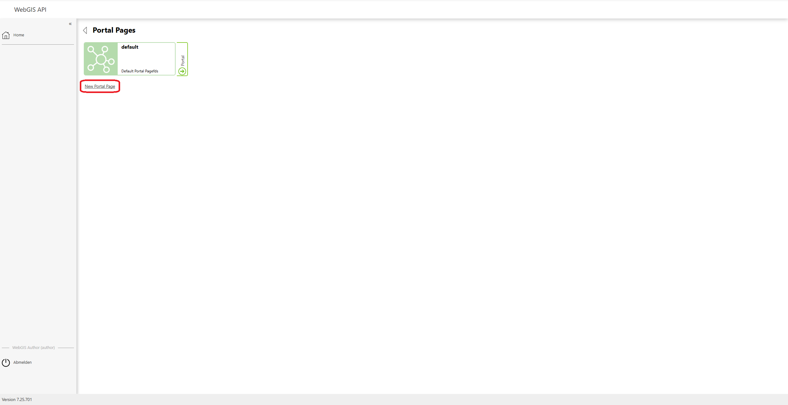
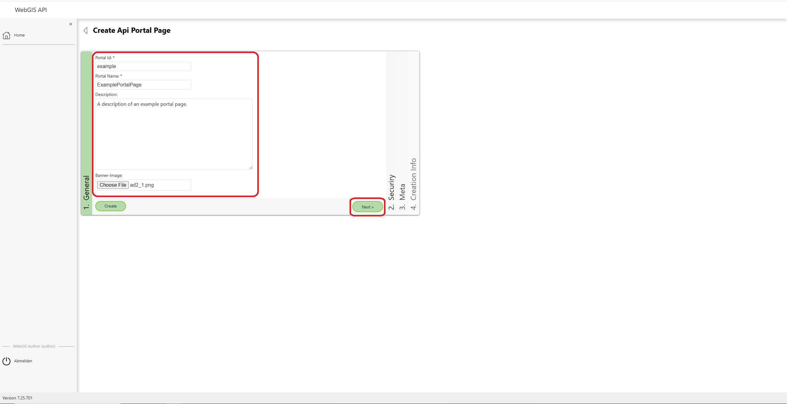
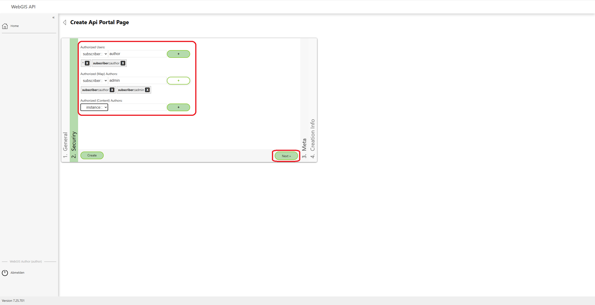
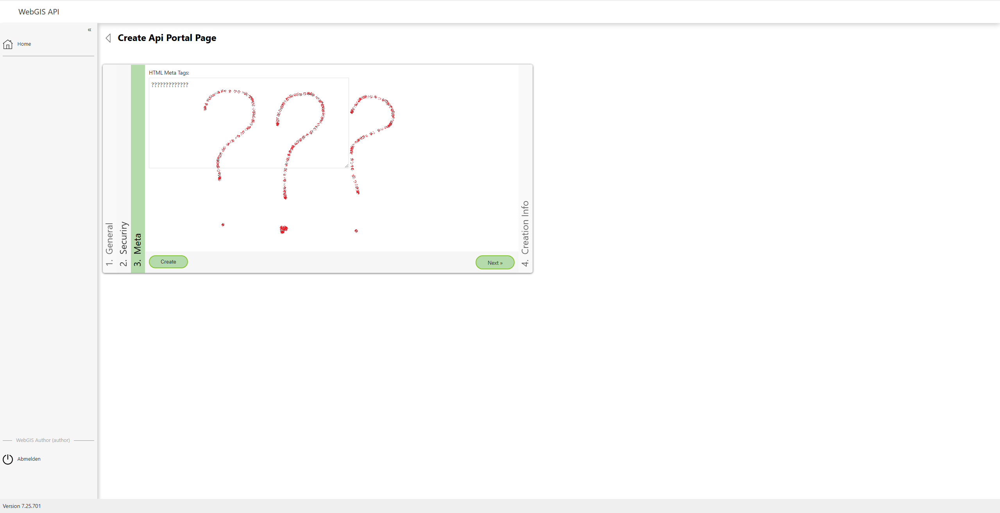
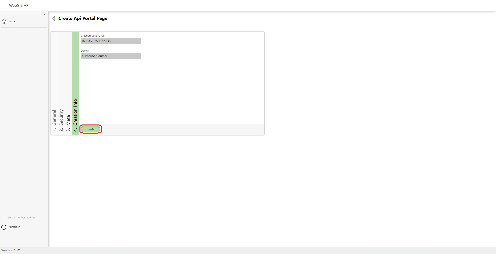
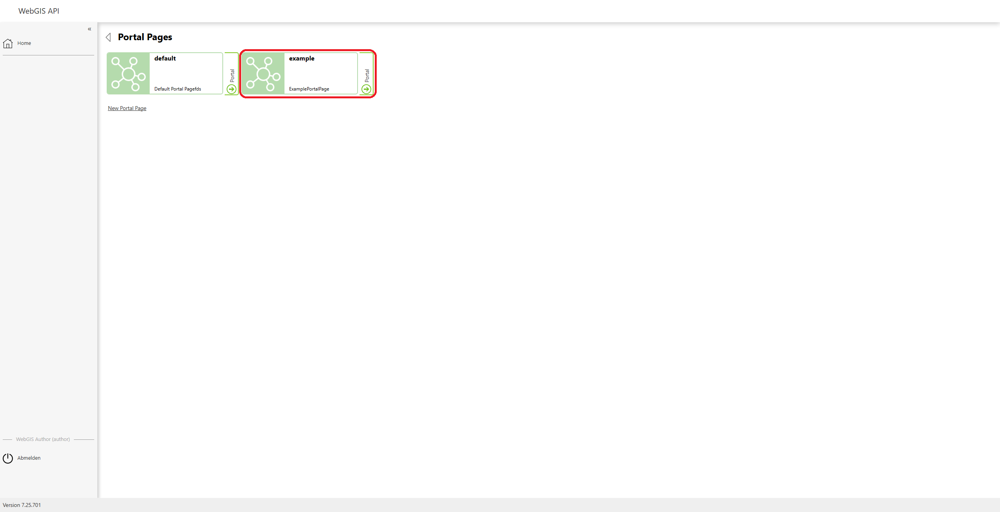

Creating and Managing Portal Pages
==================================

To create or manage a **portal page**, you must first log in to the **WebGIS API**. Once you are logged in, you can access an overview of the already created pages via the **Portal Pages** menu item, as well as create and configure new pages.

Portal Pages Overview
------------------------

Click the **Portal Pages** menu item to go to the overview of the existing portal pages.

In the overview, you can view the pages already created. To create a new portal page, click the **"New Portal Page"** button.

Creating a New Portal Page
--------------------------

Clicking the **"New Portal Page"** button takes you to the form in which you can create and configure a new portal page.

General Information
-------------------------

In the **General** form, you can set the basic information for the new portal page:
- **ID** of the page
- **Name** of the page
- **Description** of the page
- **Image** for the page's banner

Once you have filled in the fields, click the **"Next"** button to go to the **security settings**.

Security Settings
-------------------------

Under the **Security** settings, you can define the following users and permissions:
- **Authorized Users**: users who have access to the portal page
- **Authorized (Map) Authors**: users who are allowed to add map content
- **Authorized (Content) Authors**: users who are allowed to add content

Each of these users can be added as a **Subscriber** or **Instance**. Click **Next** to go to the HTML meta tags.

HTML Meta Tags
--------------

HTML **meta tags** for the portal page can be configured here. (Details on meta tags to follow.)

Creation Information
------------------------

In the **Creation Infos** section, you see the **date** and **time** the portal page was created, as well as the page's **owner**. This information is for display only and cannot be changed.

Click the **"Create"** button to save the new portal page and complete the creation process.

Created Portal Page
-----------------------

After the portal page is created, it is shown in the overview. Your page has now been created successfully.

Editing a Portal Page
-----------------------

To edit an already created portal page, simply click on the desired page in the overview. You can change or supplement the fields and then click the **"Update"** button to save the changes.

