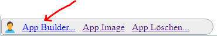
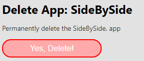

Editing / Deleting an App
=========================

If the parameters for an app need to be adjusted, this is also possible for the map author afterwards. To do this, the map author must open the app. An icon appears in the bottom left, which can be used to open the AppBuilder for this app:

The AppBuilder opens in the corresponding template, and the parameters can be adjusted. Afterwards, the app can be updated again with ``Publish App``.

The menu also offers the option to upload an image (160x160 pixels). This image is then shown on the portal page as a background image.

With the third item, ``Delete App...``, an app can be deleted again. Clicking this menu item shows a confirmation page:

Clicking ``Yes, Delete!`` permanently deletes the app.
