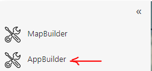
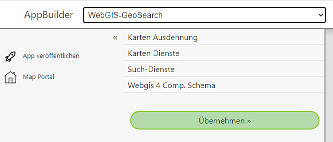

WebGIS AppBuilder
=================

With the **AppBuilder**, similar to the *MapBuilder*, WebGIS applications can be created. Here, however, these do not necessarily have to be maps. Instead, the *AppBuilder* offers special templates for applications. These templates can be customized via the *AppBuilder* with user-defined parameters (e.g. map services). The customized templates can then be published like maps in the *MapBuilder* and appear on the portal page in any category.

The **AppBuilder** is opened via the **sidebar** of the portal page:

After opening, the **AppBuilder** appears in the following form:

In the title bar, the desired template can be selected. Depending on the template, the corresponding parameters that can be customized appear in the *sidebar*. Clicking on a parameter expands the corresponding section. Once all necessary parameters have been specified, the app can be created with the ``Apply`` button in the preview area.

Once an app has been created and appears correctly in the preview area, it can be added as a tile to the portal page via the ``Publish App`` button. Just as with the *MapBuilder*, a name and a category must also be assigned here.

This description briefly introduces some of these templates and shows how an app can be published and opened.

.. toctree::
   :maxdepth: 2
   :caption: Contents:

   redirect/index
   service-side-by-side/index
   publish
   edit
   invoke
