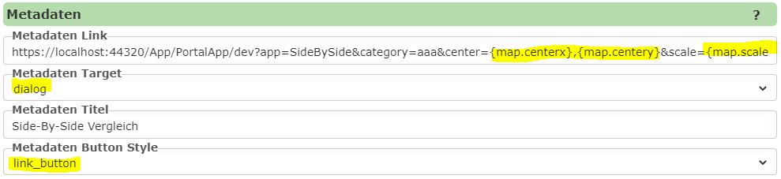
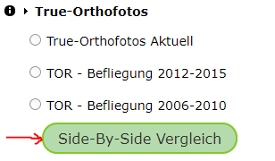

Calling / Opening an App
========================

The simplest way to open a published app is to click on the corresponding tile on the portal page. The tile for the app should appear under the selected category after publishing. However, this is only possible if ``visible`` was selected for visibility when publishing. Otherwise, the app is only shown to the map author (transparent tile) or can be opened directly via the link.

Calling via Link
----------------

The link becomes visible when the app is opened via the portal page. This should always be possible for the map author. The link has, for example, the following form:

``https://myserver.com/App/PortalApp/{portal-page-id}?app={name-of-the-app}&category={category-of-the-app}``

In addition to the mandatory URL parameters ``app`` and ``category``, further optional parameters can be passed, for example to jump to a specific map extent within the app:

* ``bbox``: the bounding box to jump to. The parameter ``srs`` can also be passed for this, to specify the EPSG code for the bounding box (default: 4326).

* ``center`` and ``scale``: map center point (longitude, latitude) and scale.

.. note::
   If, for example, the app is called from the map viewer, it is usually recommended to use ``center`` and ``scale`` instead of ``bbox``. Since the size of the map window is not always the same, the application is not opened with the same scale when using ``bbox``.

.. note::
   If the app is called from the map viewer, the corresponding placeholders for the current extent can be specified in the link, e.g. ``...&center={map.centerx},{map.centery}&scale={map.scale}``.

Calling via a Custom Tool
--------------------------------------------

As already described, an app can also be called via a link that passes the current map extent. This makes it very easy to integrate an app into the map viewer as a *custom tool*.

Custom tools are defined in the ``custom.js`` file (`see <./../KartenViewer/CustomJS/benutzerdefmarker.html#benutzerdefinierte-werkzeuge>`__).

The definition of the tool looks roughly as follows:

.. code::

    webgis.custom.tools.add({
        name: 'TOR Befliegungen',
        command: 'https://myserver.com/App/PortalApp/dev?app=SideBySide&category=Allgemein&center={map.centerx},{map.centery}&scale={map.scale}',
        command_target: 'dialog',
        image: 'https://myserver.com/openwin.png'
    });

Here, a tool is defined that opens the app ``SideBySide`` from the category ``Allgemein`` with the same scale as the map, in a dialog window.

Calling via a "Metadata" Button
------------------------------------

In the CMS, a *metadata* button can be defined for each presentation variant. This is usually shown in the TOC in front of the presentation variant as an (i) button. This mainly serves to show a link to metadata for a topic.

Since the link stored here can also be given the placeholders shown above for the current map extent, and the button can also be shown in a different form, the "metadata" button offers another option for calling an app.

.. note::
   The advantage here is also that calling an app is always/only possible if a certain topic is present in the map.

An example here is the comparison of aerial imagery flights. In a service that is integrated into a map, there are presentation variants for the different flights. The user can toggle these individually. At this point in the TOC, it should also be possible to open the app with the *side-by-side* comparison of the individual flights in a dialog.

To do this, the following settings must be made in the CMS, in the presentation variant under which the button should appear:

For the user, this button in the TOC looks as follows:

