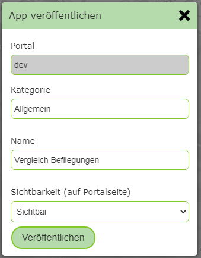

Publishing an App
===================

Once all parameters have been entered for an app template and the preview matches expectations, the app can be published with the
*sidebar* button ``Publish App``.

Publishing shows this app on the portal page (unless it is defined as invisible), or it can be called via the corresponding URL.

Clicking the ``Publish App`` button shows the following dialog, analogous to the *MapBuilder*:

Here, a category and a name can be specified for this app. *Visibility* determines whether the app is shown as a tile on the portal page.
If ``hidden`` is specified here, it is not visible to a user and can only be called via a link. This makes sense, for example, if the app
is called from the map viewer via a custom tool or a hotlink.
