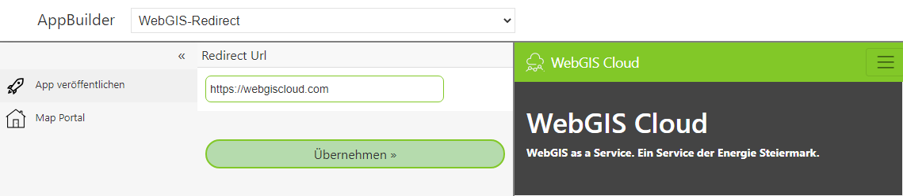

App Template: Redirect App
==========================

Probably the simplest *app* is the template found under WebGIS-Redirect. This template is used to
redirect a user to a specific website.

For this app, exactly one parameter, ``Redirect Url``, can be specified:

Under ``Redirect Url``, the URL to redirect to is specified. Clicking ``Apply`` afterwards shows the
page in the preview in an IFrame.

If you publish this app, a tile appears on the portal page under the corresponding category.
If the user clicks on this tile, they are redirected to the website specified here.

With this *app*, it is possible to jump to any website via the portal page. This means, for example,
*DataLinq* pages can also be offered on the portal page like a map.

.. note::
   The app immediately redirects users to the desired page. This does not apply to the creator of this app.
   The creator stays on an intermediate page and must trigger the redirect by clicking. The reason is that
   administration of this app can only be done via this intermediate page:

   .. image:: img/redirect2.png
