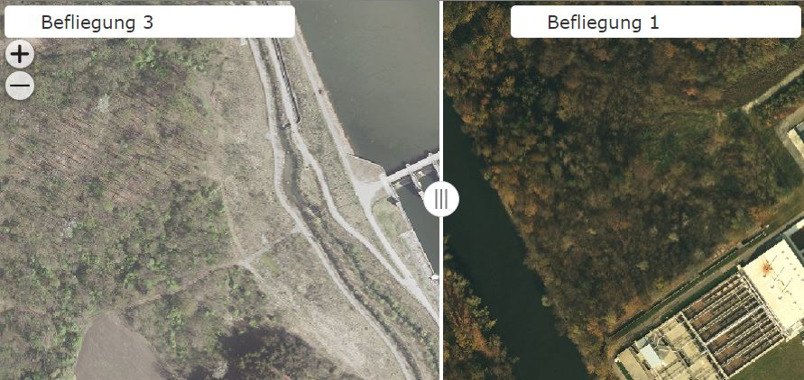
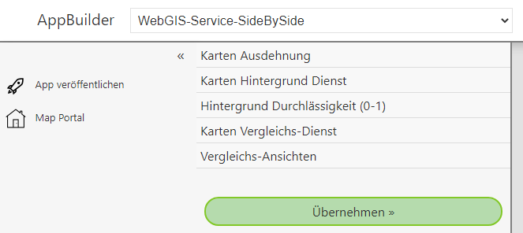
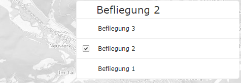
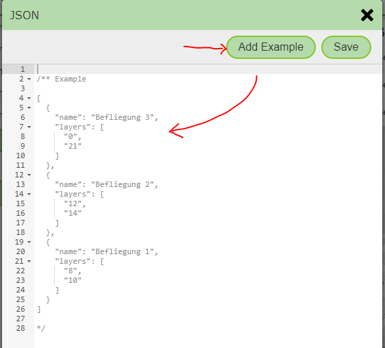

App Template: Service Side-by-Side
==================================

With this template, it is possible to show a map service with different presentations side by side.
The dividing line between the two presentations can be freely moved, so that the differences can be seen more clearly.
The template can be used, for example, to compare different flight campaigns of aerial imagery:

If you select the template, the following parameters can be specified:

Here is a description of the individual parameters:

Map Extent
-----------------

An extent must be specified for every WebGIS API map application. In addition to the extent, this also defines the zoom levels and the map projection
(see the definition of an extent in the CMS).
All available extents from the CMS are listed here. Clicking on an item selects it.

Map Background Service
-------------------------

The map service used for comparison is usually a WMS/AGS service. These have the disadvantage that the display does not appear as smooth
as with a preprocessed *tiling* service. So that the app still appears smooth when changing the map extent, a background service must be specified here,
which is shown below the actual service being compared.

.. note::
   The background service should be a *tiling* service. It is also important to ensure that the service matches the extent selected above (projection and zoom levels).

Background Opacity
---------------------------

Since the background service only serves usability and orientation, i.e. is essentially a supporting element in the application, it can be shown transparently (lightened).
A value between 0 and 1 can be specified here, where ``0`` means fully transparent and ``1`` means fully opaque.

Map Comparison Service
------------------------

The actual service to be compared is specified here. Again, all services available in the CMS are listed. Exactly one service can be selected.

Comparison Views
--------------------

For data from the service to be compared, the service must be shown with different layer toggles on the left and right. Which layers these are
can be specified here. The options are not limited to two variants; any number of views can be defined.
The user can then select the desired view for each side in the app:

For these views, the presentation variants for this service from the CMS are not used; instead, the individual toggles are entered here in *JSON* format.
When you open the *JSON editor*, an example must first be inserted, which can then be adapted to your own needs:

.. note::
   JSON is the JavaScript description of an object. The inserted example is initially *commented out*. To use it, the lines with ``/*`` and ``*/`` must first be removed.

For the individual views, the IDs of the affected layers must be specified as an *array*. The individual IDs must be strings (enclosed in double quotes): ``"layers": ["1", "2", "3"]``.
Since the views are a list (array), the elements must be separated by a comma and enclosed in square brackets. The individual view elements are defined using curly
braces. ``name`` and ``layers`` can be specified as attributes.

A valid JSON here looks, for example, as follows:

.. code::

   [
        {
            "name": "Befliegung 3 (2020)",
            "layers": ["0","21"]
        },
        {
            "name": "Befliegung 2 (2015)",
            "layers": ["12","14"]
        }
   ]

The JSON can be saved with the ``Save`` button.

Finally, the app can be shown in the preview with ``Apply`` and then published with ``Publish App``.
