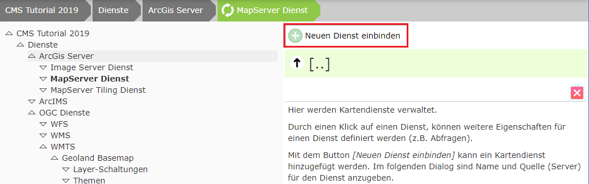
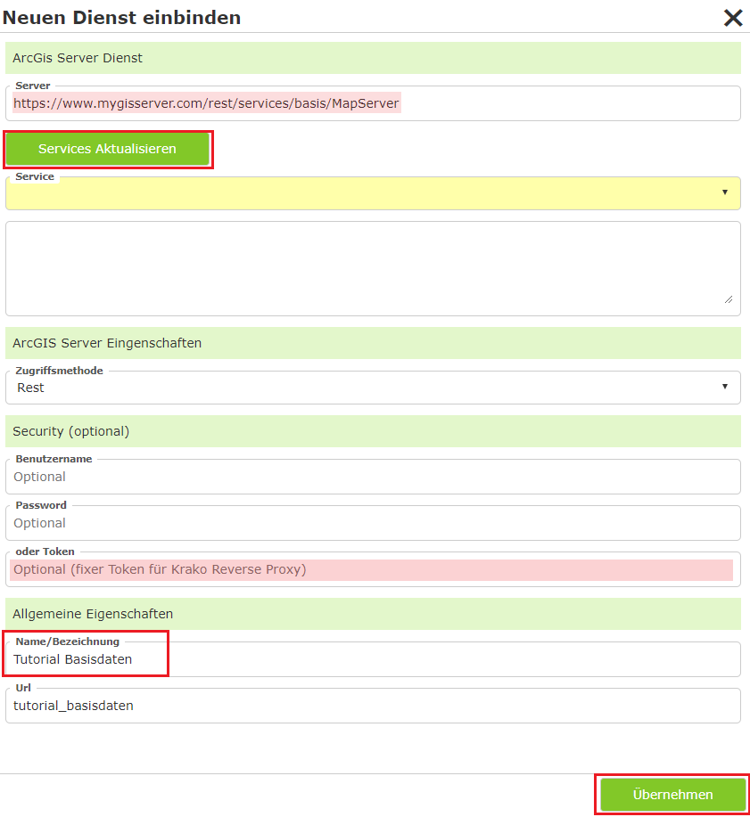
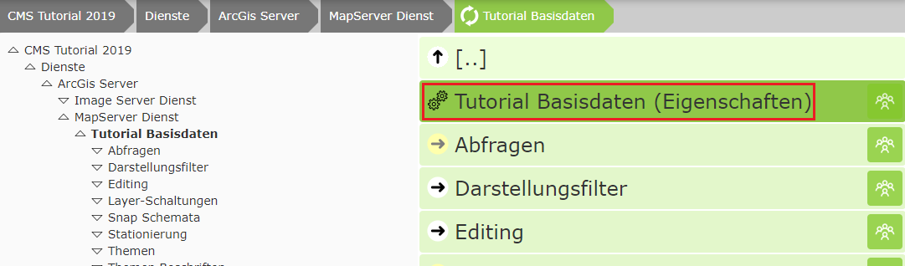
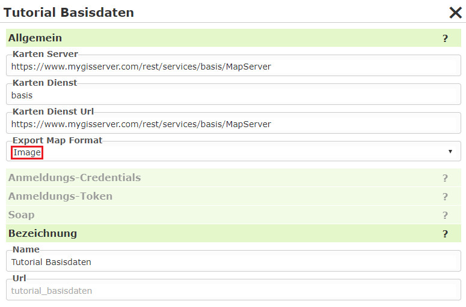
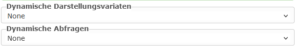

Integrating an ArcGIS Server Service
======================================

For this, switch to ``Services/ArcGIS Server/MapServer Service`` in the CMS tree:

Click ``Integrate new service``:

Then click ``Update Services``, assign a name, and click ``Apply``.

.. note::
   If the name is maintained in the MXD in the case of AGS, it is also already adopted automatically. If
   it is not maintained, the name in the service is "Layer" or "Layers" => it is not adopted into the CMS => it becomes "General".

Applying can take a few seconds. Afterwards, you can click on the service in the view and edit further properties of the service:

Once the service appears in the list, further properties of the service can be edited:

* **Export Map Format:**
  Normally, the AGS returns the result of a map request in JSON format. This contains the URL
  to the actual image in the output directory. In our case, the image is stored in the output directory behind our
  firewall and is NOT reachable via the internet. The map image would therefore be created, but
  is not reachable for the browser. The value "Image" remedies this problem. In this case, the
  result from the AGS is returned not as JSON, but as an image (bytes). WebGIS receives this directly and stores it in the
  "Cloud" output directory, which is available via the internet. In the cloud, this method also has the advantage
  that it cannot be traced via the internet where the map service comes from.
  Client (Browser) <-> WebGIS <-> ArcGIS Server

.. note::
   For a WebGIS instance installed at a customer's site, this value should generally be left empty or set to JSON,
   because a client usually has access to the output directory. This generally results in less traffic:

   1. Client (Browser) <-> WebGIS <-> ArcGIS Server (ImageRequest/JSON)
   2. Client (Browser)            <->           Output directory

Dynamic Services
------------------

The following settings offer a simplification when it comes to parameterization:

Normally, both presentation variants and queries must be parameterized separately in the CMS for a service.
This gives the administrator flexibility to determine which topics can be toggled visible or
queried, and in what way. However, a grouping of the topics is often already defined in the service. To avoid
parameterizing the same thing in multiple places, this setting can be used. This creates the presentation variants
*dynamically* from the service.

.. note::
   Below the service there are the sections ``Queries`` and ``Layer Toggles``, where these properties can be
   parameterized individually. If you set a value other than ``None`` in the options shown here, these sections
   disappear. It is only possible to make the content available either *dynamically* or *individually parameterized*.

Dynamic Presentation Variants
++++++++++++++++++++++++++++++++

* **None:** The presentation variants must be parameterized individually. To do this, the individual toggles must first be defined in the ``Layer Toggles`` section of the service. These can then be added to a presentation container in the ``Map Viewer`` CMS node. This process is described in the following sections.

* **Auto:** The topic tree is taken from the service. For each topic, a *checkbox* button is offered in the corresponding group. In the map viewer, a separate container for this service is created in the presentation-variants TOC.

* **AutoMaxLevel(1,2,3):** The topics are likewise taken from the service here. However, not all hierarchy levels are adopted. The maximum number of levels corresponds to the value specified here. Topics that are located at a deeper level are combined into a single topic (group) that can be toggled via a *checkbox*.

  Example: a service has the following topics:

    * Base data/Cadastre/Parcels
    * Base data/Cadastre/Usage symbols
    * Base data/Cadastre/Labeling

  With ``Auto``, the tree is displayed as follows:

  .. code::

        [[  Service Container ]]
        -----------------------
        + Base data
          + Cadastre
            [x] Parcels
            [x] Usage symbols
            [x] Usage symbols

  ``AutoMaxLevel2`` would limit the tree to two levels. The bottom group would appear as a *checkbox* and toggle all topics beneath it:

  .. code::

        [[  Service Container ]]
        -----------------------
        + Base data
          [x] Cadastre

  ``AutoMaxLevel1`` finally allows only one level within the presentation-variants container:

  .. code::

        [[  Service Container ]]
        -----------------------
        [x] Base data

.. note::
   With dynamic presentation variants, the individual layers are always toggled via *checkboxes*. If you want to
   use additional options (buttons, option boxes, markers), the complete tree must be parameterized in the CMS via
   layer toggles/presentation variants.

Dynamic Queries
+++++++++++++++++

* **None:** The queries must be parameterized for the service in the ``Queries`` section. This process is described in the next section.

* **Auto:** A query topic is created at runtime for each queryable topic in the service. All fields are shown in the results table.

.. note::
   All queryable topics are offered as a query with all fields. If certain topics should be
   available as a query, or if search fields should be searchable within topics, all queries
   must be parameterized in the CMS.
