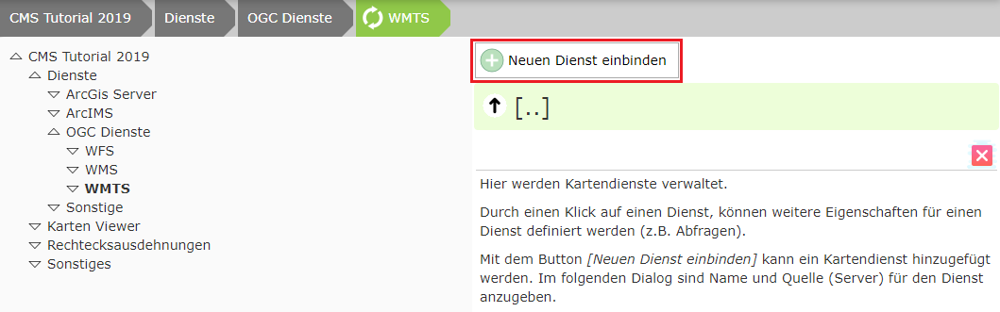
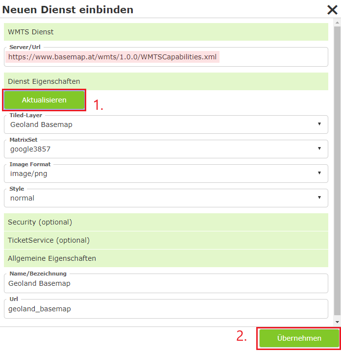
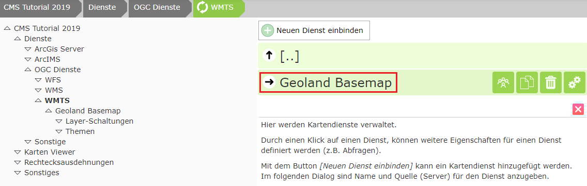
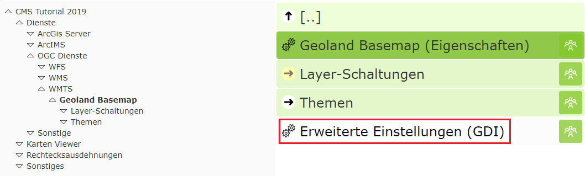
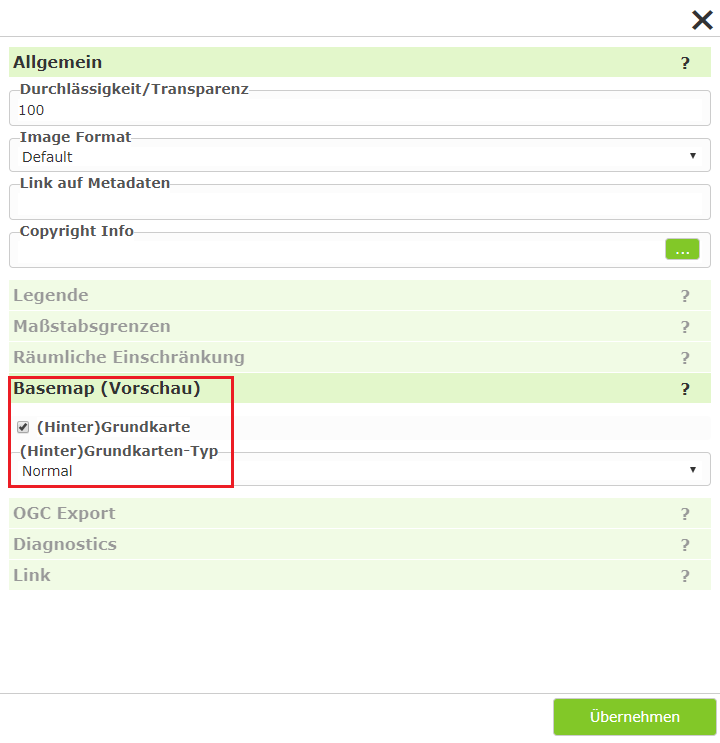

Integrating a WMTS Tilecache Service
=====================================

For this, switch to ``Services/OGC Service/WMTS`` in the CMS tree:

Click ``Integrate new service``.

In the dialog, enter the URL to the WMTS service (https://www.basemap.at/wmts/1.0.0/WMTSCapabilities.xml) and click ``Update``:

The missing values are filled in automatically. In the case of WMTS, the desired tiled layer can still be selected,
which in turn adjusts the remaining values.

Then click ``Apply``:

**Caution:** So that a service can later also be toggled like a background service, the value Basemap must
still be set to "true" in the Advanced Properties. The Web CMS should detect this automatically and fill it in correctly. If the
service is additionally also an overlay tile cache (e.g. street names over orthophoto), the "Overlay" option must be
handled in the same way.

Click on the service:

The same procedure can now be used to load additional tiled layers of the basemap.

**Note:** Integrating a service as WMTS has the advantage that descriptions and copyright references are
already included here. These are adopted directly and later shown in the viewer.
