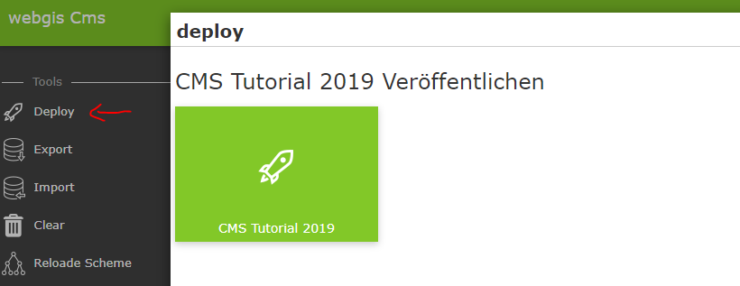
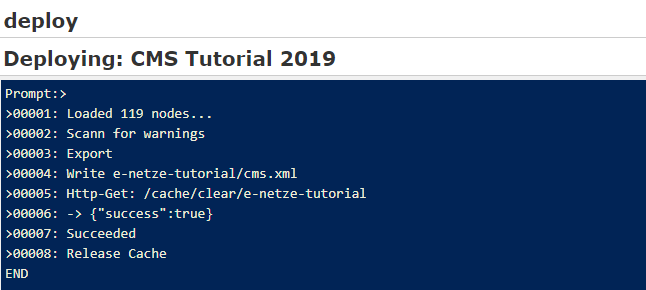
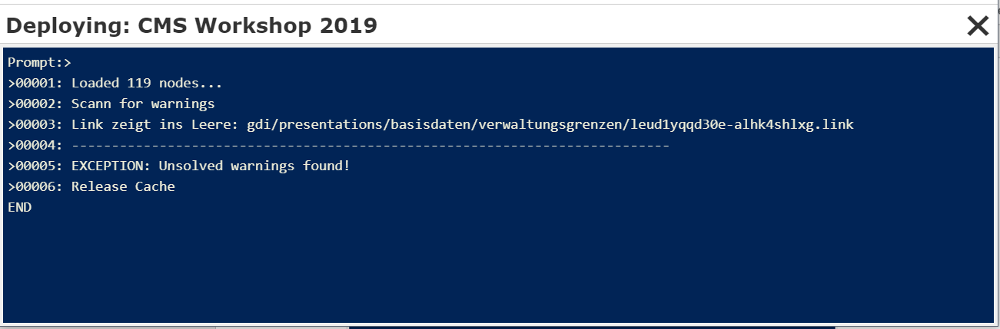
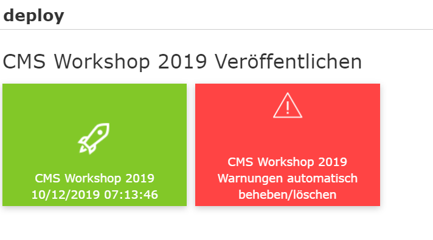
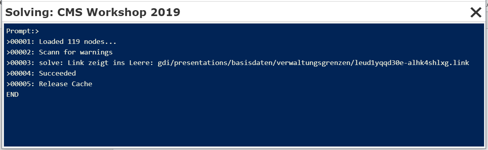

Publishing the CMS
===================

To check how the parameterization done so far looks in the viewer, the CMS can be published once. To do this, click ``Deploy`` in the sidebar:

A dialog appears with a button that once again shows the name and, if applicable, the date of the last publication.

Clicking this button starts the build process:

Depending on the size of the CMS tree, this process can take a few moments. If the build is successful, the message *Succeeded* is displayed at the end and the dialog can be closed with ``X``.

If warnings occur during publishing, for example because there are presentation variants that reference deleted layer toggles, the process is aborted:

A CMS with a warning can no longer be published. There are two ways to resolve the conflict:

1.	Based on the message shown, find the problem and delete the corresponding reference (here a presentation variant).
2.	Automatically delete the warning.

Regarding 2:
After the warnings are shown, close the window. In the deploy dialog, a note now appears indicating that there were warnings during the last publish:

Clicking the red button attempts to automatically resolve the warnings, which essentially means that the corresponding references are deleted.

**Caution:** You should only do this if deleting the layer toggle, for example, was intentional. Otherwise, references may be deleted unintentionally:

After this process, the red button disappears from the deploy dialog and the CMS can be published again.
