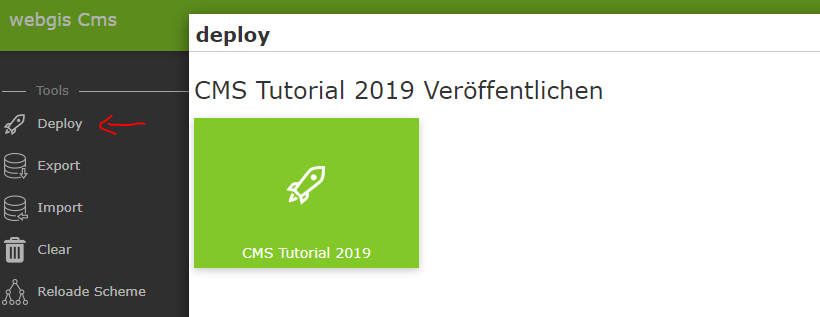
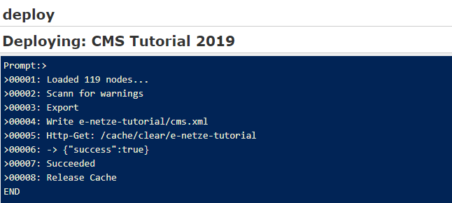
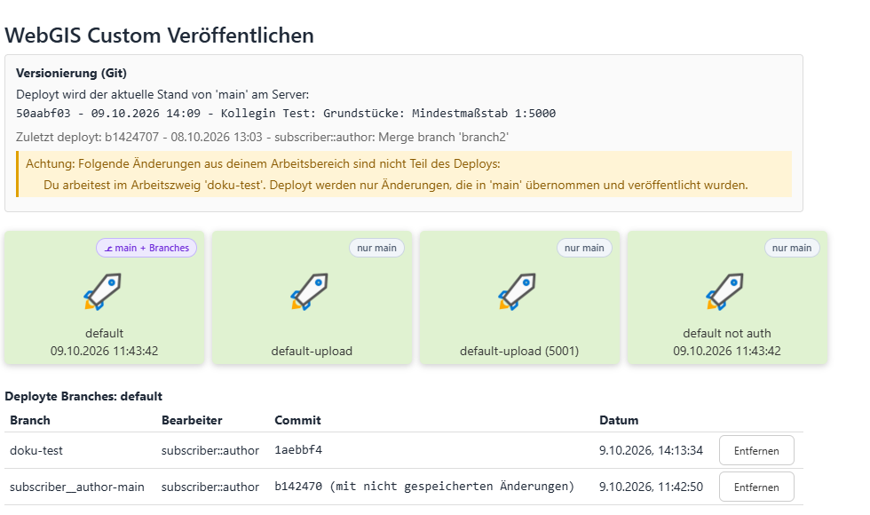
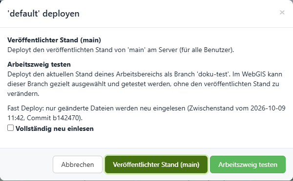

Publishing the CMS
===================

To check how the parameterization done so far looks in the viewer, the CMS can be published once. To do this, click ``Deploy`` in the sidebar:

A dialog appears with a button that once again shows the name and, if applicable, the date of the last publication.

Clicking this button starts the build process:

Depending on the size of the CMS tree, this process can take a few moments. If the build is successful, the message *Succeeded* is displayed at the end and the dialog can be closed with ``X``.

If warnings occur during publishing, for example because there are presentation variants that reference deleted layer toggles, the process is aborted:

.. image:: img/image35.png

A CMS with a warning can no longer be published. There are two ways to resolve the conflict:

1.	Based on the message shown, find the problem and delete the corresponding reference (here a presentation variant).
2.	Automatically delete the warning.

Regarding 2:
After the warnings are shown, close the window. In the deploy dialog, a note now appears indicating that there were warnings during the last publish:

.. image:: img/image36.png

Clicking the red button attempts to automatically resolve the warnings, which essentially means that the corresponding references are deleted.

**Caution:** You should only do this if deleting the layer toggle, for example, was intentional. Otherwise, references may be deleted unintentionally:

.. image:: img/image37.png

After this process, the red button disappears from the deploy dialog and the CMS can be published again.

.. _cms-deploy-git:

Deploy with Git
---------------

.. versionadded:: 9.26.4102

If a CMS is versioned with Git (see :ref:`cms-git`), the deploy page additionally shows a section **Versioning (Git)**:

It shows

- which state of ``main`` on the Git server will be deployed (commit, date, author and description),
- which state was deployed last,
- whether there are changes in the own workspace that are **not** part of the deployment (e.g. unsaved or unpublished changes, or because you are working in a working branch).

Each deploy tile shows a label indicating which kind of deployment is possible:

- **main only:** Only the published state can be deployed.
- **main + branches:** Additionally, the own workspace can be deployed as a branch (see :ref:`cms-deploy-branch`). This must be enabled for the deployment in the ``cms.config`` with ``allowBranchDeploy`` (see :doc:`../../config/cms/index`).

Published state (main)
~~~~~~~~~~~~~~~~~~~~~~

The normal deployment always deploys the **published state**, i.e. the current state of ``main`` on the Git server, and **not** the content of the own workspace. This way, only changes that have been saved, published and merged into ``main`` end up in the WebGIS. It does not matter which editor starts the deployment.

For this, the CMS uses its own copy of the Git repository on the server (*deploy clone*), which is updated before each deployment. Per CMS, only one deployment of the published state can run at a time.

.. _cms-deploy-branch:

Testing a working branch (branch deploy)
~~~~~~~~~~~~~~~~~~~~~~~~~~~~~~~~~~~~~~~~

A branch deploy publishes the **current state of the own workspace**, including unsaved changes, as a separate *branch* next to the published state. This way, changes can be tested in the WebGIS before they are merged into ``main``. Other users still see the published state.

.. note::

    Branch deploys are intended for **development and test environments**. On a production system, usually only the published state (main) is deployed. Therefore, branch deploys must be enabled explicitly per deployment (``allowBranchDeploy`` in the ``cms.config``), and the WebGIS API must allow branches (``allow-branches`` in the ``api.config``, see :doc:`../../config/api/index`).

Clicking a tile labeled *main + branches* opens a selection dialog:

- **Published state (main):** normal deployment as described above.
- **Test working branch:** branch deploy of the own workspace. The name of the current working branch is used as the branch name. If you work directly in ``main``, the branch name is ``{user}-main``.

How a deployed branch is selected and tested in the WebGIS is described in :ref:`portal-branches`.

Below the tiles, **Deployed branches** lists all branches that have been deployed for this deployment (branch, editor, commit, date). *Remove* deletes a branch deploy again. If a working branch is deleted in the CMS (also with *Merge into main* and the option *Delete working branch afterwards*), its branch deploys are removed automatically. Branch deploys of the form ``{user}-main`` must be removed manually.

If warnings occur during a branch deploy, a separate tile for fixing these warnings is shown. The warnings of the published state are not affected.

.. _cms-deploy-fast:

Fast deploy
~~~~~~~~~~~

By default, a branch deploy is executed as a **fast deploy**. With the first branch deploy, the entire CMS tree is read and a snapshot is stored. With every further branch deploy, only the files that have changed since then are read again (determined via Git). The result is identical to a full deployment, but many times faster for large CMS trees.

The selection dialog shows when the snapshot was taken. The option **Read everything again** discards the snapshot and reads the entire tree again. This is normally not necessary.

The deployment log shows how many paths have changed and how long reading took:

.. image:: img/deploy-fast-console.png

The snapshot is stored per editor on the CMS server (not in the Git repository) and is deleted together with the workspace. The deployment of the published state always reads the entire tree.
