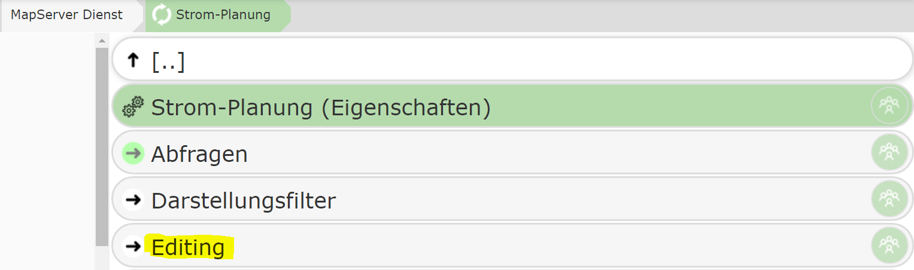
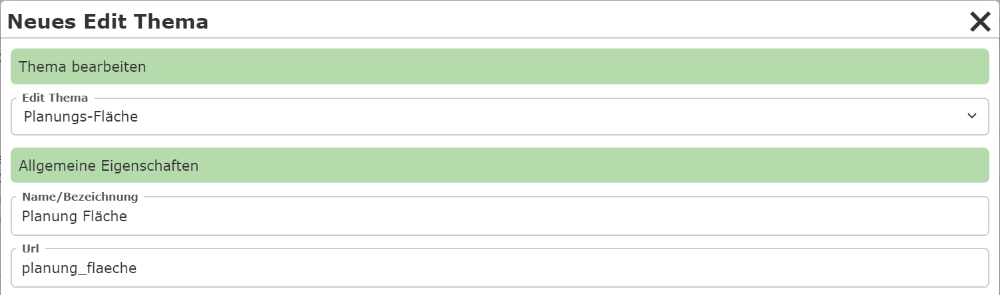
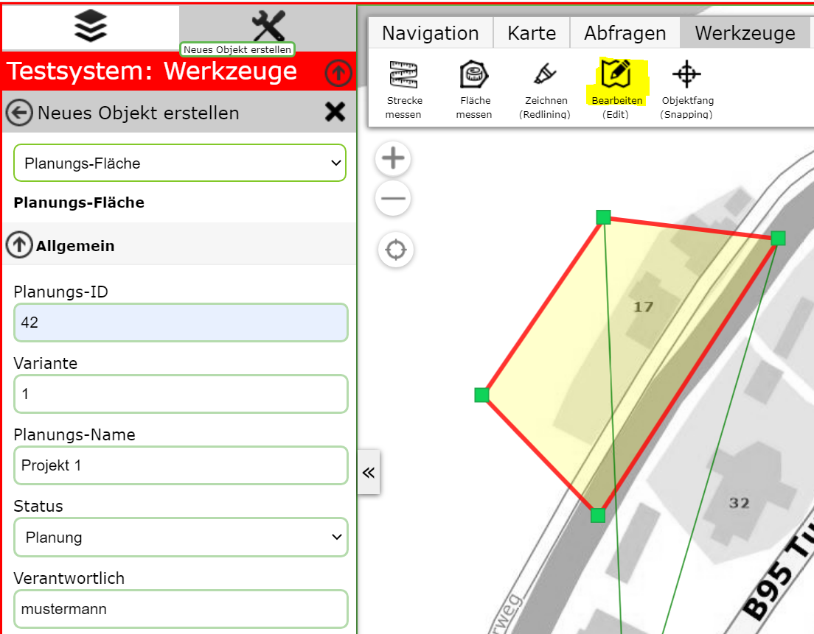
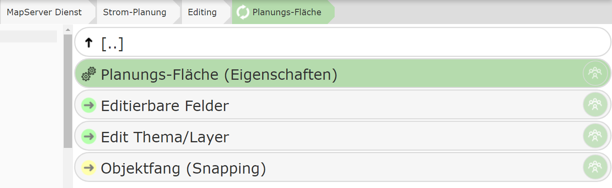

Creating an Edit Theme
======================

To create a new edit theme, switch to the ``Editing`` area in the (AGS) service.

This area lists all the topics that can be edited in the map application.
By default, no topic within a service is editable. Only by adding a
topic to this area/node does the user gain the ability to edit it.

.. note::
   The CMS tree can be secured with permissions at any point. For example, a specific edit theme
   can be made available only to a restricted group of users. If you want to protect editing as a whole,
   the permission can be set directly on the ``Editing`` area/node.

Adding a New Edit Theme
--------------------------

To add a topic, click the ``New Edit Theme`` button.

Here, for example, the topic **"Planning Area"** is selected, which allows the user to draw a polygon
that delineates the planning area.

Under *Name/Label*, you can specify the name under which the edit theme is shown.
This name does not necessarily have to match the name of the display layer.

In addition to the geometry, relevant attribute data should be entered, e.g.:
- Planning number
- Variant
- Status
- Responsibilities

Once the user creates a new planning area, the editing form could look as follows:

### Editing an Edit Theme

After creation, the edit theme appears in the list. Clicking on the topic provides the following
editing options:

Under **Edit Theme/Layer**, the reference to the map service layer to be edited is shown.
Since this was already selected in the previous step during creation, no further action is required here.
