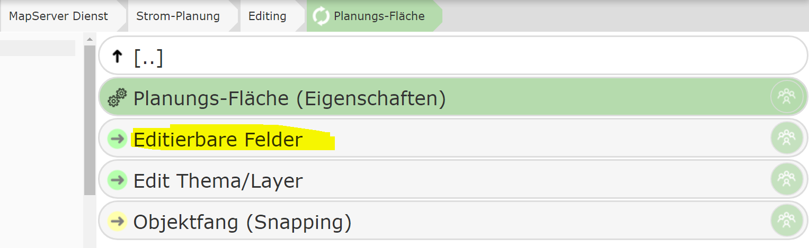
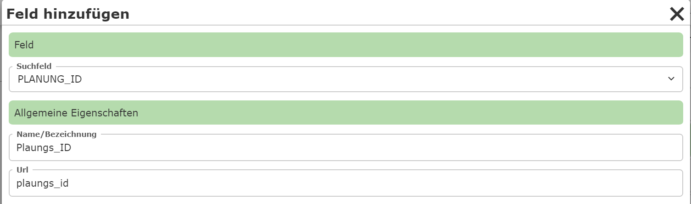
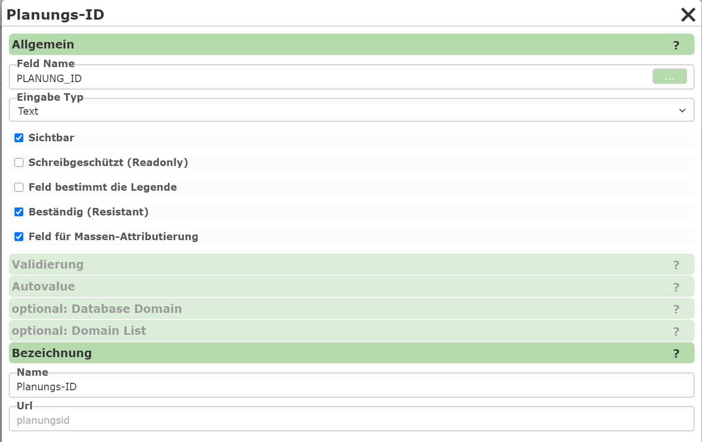

Editable Fields
==================

This section specifies which attribute data is made available to the user for an edit theme.
The individual attributes of a geo-object can be entered via input fields, selection lists, date fields, etc.

If many attributes need to be entered, it is recommended to split them into different categories.
The individual categories can then be expanded individually in the attribute data form.

As a first step, therefore, a category must first be created using the ``New Category`` button.
For a start, a category named ``General`` is sufficient, for example. After that, clicking on a category
lets you define input fields within it or edit existing ones.

To add a new input field (attribute), click ``Add Field`` within a category:

Under ``Field``, you specify the attribute to be edited. After the selection, a name
must still be assigned, under which the field is shown in the input form.

A newly created input field is shown in the list immediately after creation. Clicking on an input field opens a
dialog with further properties:

The type of input is determined via the ``Input Type``:

* **Text:** A simple text input field.
* **Domain:** A selection list with defined values. The values can be stored statically in the CMS or retrieved from a database.
* **TextArea:** A multi-line input field.
* **Date:** A date input field.
* **File:** For uploading files.
* **Info:** A pure informational text (no interaction with the user).

  .. note::

    The text for Info can also be a (restricted) **Markdown text**.
    This allows the use of links and other formatting.
    For this, the text must begin with ``md:``.
    Links can be integrated as follows:

    * ``md: Any text [link text](https://www.example.com)``: this shows a link;
      the URL is opened in a new tab when the user clicks on it.

    The *link syntax* can be extended further as follows:

    * ``[[Link text]](https://www.example.com``: shows the link as a button.
    * ``{Link text}(https://www.example.com)``: the link is opened in a popup.
    * ``{[Link text]}(https://www.example.com)``: the link is shown as a button and opened in a popup.

Additionally, under ``General``, there are the following options for an input field:

* **Visible:** Specifies whether the field is visible to the user. Invisible fields can be practical if they are only calculated later via an AutoValue.
* **Read-only:** Similar to "Visible". Here, the field is shown, but cannot be changed by the user.
* **Field determines the legend:** If the edit theme has a legend on the map with different symbols that depend on the value of this field, this option can be enabled. The user can then also select the corresponding (legend) symbol via the selection list next to the table value.
* **Resistant:** The value of the field is retained after saving and does not need to be entered again each time. This also applies if the same field exists in different topics. For example, a project number that is stored on every object only needs to be entered once and remains "resistant" in the form until the user assigns a different project number.
* **Field for bulk attribution:** If bulk attribution (changing multiple selected objects at the same time) is allowed, this specifies whether the field can be set via bulk attribution.
