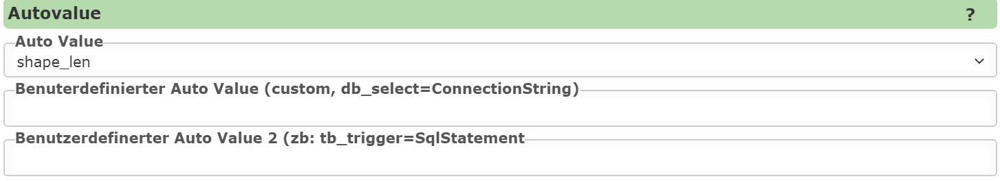
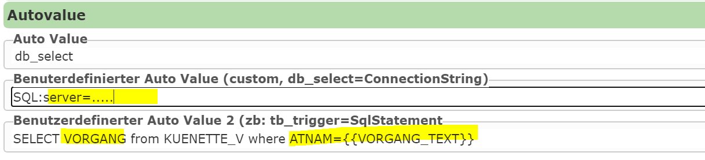

Editable Fields: Autovalues
==============================

*Autovalues* are fields that do not have to be entered by the user, but are set *automatically*
on the server before saving.

Examples of such fields are:

- The user name of the current user: ``create_login``, ``create_login_full``, ``create_login_short``, ...

- The creation date of an object: ``create_date``, ``create_time``, ...

- The length of a line geometry: ``shape_len``, ``shape_area``, ...

- GUIDs

  * ``guid``: a GUID in this format ``4b2dd0dfeb1b40188b2583167886e886``
    is suitable if the GUID should be stored as text in the database.
  * ``guid_sql``: a GUID in this format ``{9e2702e4-169f-41ec-b3e3-fcf786182885}``
    is suitable if the GUID should be stored as a GUID in an SQL database.
  * ``guid_v7``, ``guid_v7_sql``: like above, but with a version 7 GUID.
    Version 7 GUIDs are suitable for storage in databases when the underlying
    fields should also be indexed. The generated GUIDs are sorted chronologically by
    their value, which generally leads to less fragmentation of the indexes.

These fields are usually defined as *read-only* or invisible in the input form.

In the following example, the length of the created line geometry is written into a field:

Custom Values with "custom"
-------------------------------------

With the *autovalue* ``custom``, values can be defined directly in the input field.
For example, a field **SOURCE** can always have the value ``WEBGIS`` entered:

``=WEBGIS``

Additionally, values can be taken from the viewer's URL parameters.
This works with *native* URL parameters (see section: Calling the Viewer):

``url-parameter:project_id``

Automatic Attribution via Spatial Relationships
------------------------------------------------------

Spatial relationships to other feature classes can also be used for automatic attribution:

``NR FROM GDBAbfrage SERVICE kataster``

→ Here, the attribute **NR** is taken from objects in the **GDBAbfrage** topic,
   if they spatially overlap with the saved object.
   If there are multiple matches, they are separated by **semicolons**.

``TYP FROM kasten SERVICE strom@mycms BUFFERDIST 20 SEPARATOR space-space MAX 10``

→ Here, the attribute **TYP** is taken from objects in the **Kasten** topic,
   if they are within a radius of **20 m** (``BUFFERDIST 20``).
   Multiple results are separated with **space-hyphen-space**
   (``SEPARATOR space-space``). A maximum of **10 results** are adopted (``MAX 10``).

Automatic Values from a Database Query ("db_select")
-----------------------------------------------------------

The autovalue ``db_select`` allows a field to be filled automatically
via a database query. The following information must be provided for this:

- **ConnectionString** → the connection to the database
- **SQL Statement** → the query for the desired field

**Placeholders** such as ``{{VORGANG_TEXT}}`` can be used to access current input values.

Autovalues via Web Service (DataLinq)
-------------------------------------

Instead of a database, a web service can also be used as the data source for ``db_select``.
An example of a *DataLinq* query:

``https://localhost:44341/datalinq/select/auswahllisten(oJ...token)@color?value=4711``

This query returns the following JSON result:

.. code-block:: javascript

   [
      {
        "value": "4711",
        "name": "Blau"
      }
   ]

To integrate this service, the fields **ConnectionString** and **SqlStatement**
must be filled in as follows:

**ConnectionString:**

``https://localhost:44341/datalinq/select/auswahllisten(oJ...token)@color``

**SqlStatement:**

``value={{color}}``

Here, ``color`` is the edit input/selection-list field used for this autovalue.
In this example, the value **"Blau"** would be adopted as the autovalue.

.. note::
   - The **first result** of the query is always used.
   - For a URL query, the value is taken from the field **"name"**.
   - For *DataLinq PlainText* endpoints, the field is always called **"text"** by definition.
   - If a custom SQL query is used in *DataLinq*, the desired field should be renamed:

     ``SELECT FARBE as name FROM TABLE WHERE ...``

.. note::
   **Security note:**
   - *Connection strings* or URLs with tokens should not be stored directly in the CMS.
   - Instead, these values should be stored in the ``secrets`` section.
   - The connection string can then be specified with a **placeholder**:

     ``{{select-datalinq-endpoint-auswahllisten}}@color``
