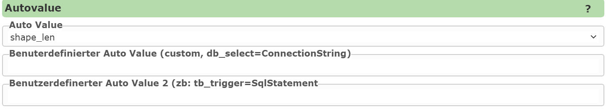

Editable Fields: Autovalues
===========================

*Autovalues* fill an attribute field **automatically** on the server when saving; the user does not
have to enter the value. They are configured on the edit field. These fields are usually defined as
*read-only* or invisible in the input form.

.. contents:: Contents of this page
   :local:
   :depth: 1

Selection in the CMS
--------------------

Most autovalues are selected from a list in the CMS field **Auto Value**. For free syntax, choose
**custom** and enter the actual value under **Custom Auto Value**.

This applies in particular to:

* Expressions and templates with a leading ``=``
* URL and role parameters
* Spatial queries with ``from``
* ``mask-insert-default::...``
* The older, still supported values ``create_user``, ``change_user``,
  ``create_date_yyyy.mm.dd`` and ``datetime``

For ``db_select`` and ``db_select_on_insert``, the autovalue itself is selected in the list.
The connection string and SQL statement are entered in the two additional custom autovalue fields.

In the following example, the length of the created line geometry is written into a field:

When is an autovalue evaluated?
-------------------------------

An autovalue can apply depending on the edit operation:

.. list-table::
   :header-rows: 1
   :widths: 40 12 12 12 12 12

   * - Group
     - Insert
     - Update
     - Delete
     - Mass attribution
     - Transfer
   * - ``create_*``, ``guid*``
     - yes
     - no
     - no
     - no
     - no
   * - ``change_*``
     - yes
     - yes
     - yes
     - yes
     - yes
   * - ``db_select_on_insert``
     - yes
     - no
     - no
     - no
     - no
   * - ``oninsert:...``
     - yes
     - no
     - no
     - no
     - no
   * - ``onupdate:...``
     - no
     - yes
     - no
     - no
     - no
   * - Geometry, context and general autovalues
     - yes
     - yes
     - yes
     - yes
     - yes
   * - ``db_select``
     - yes
     - yes
     - yes
     - yes
     - yes
   * - Expressions with ``=``
     - yes
     - yes
     - yes
     - yes
     - yes

.. note::

   The table describes the evaluation of the autovalue. Whether a field is actually processed for a
   given operation additionally depends on the respective editing workflow.

Values on insert only
---------------------

These autovalues are set only when a new feature is created.

User and login
^^^^^^^^^^^^^^

.. list-table::
   :header-rows: 1
   :widths: 28 52 20

   * - Autovalue
     - Description
     - Example
   * - ``create_user``
     - Database user of the editing workspace connection
     - ``webgis_edit``
   * - ``create_login``
     - Login of the current user without the WebGIS namespace before ``::``
     - ``DOMAIN\max``
   * - ``create_login_full``
     - Full login as stored on the current user
     - ``oidc::DOMAIN\max``
   * - ``create_login_short``
     - Login without WebGIS namespace and without Windows domain
     - ``max``
   * - ``create_login_domain``
     - Domain from ``name@domain`` or the part before ``\`` in the full login
     - ``domain`` or ``DOMAIN``

Example for the full login ``oidc::DOMAIN\max``:

* ``create_login`` → ``DOMAIN\max``
* ``create_login_full`` → ``oidc::DOMAIN\max``
* ``create_login_short`` → ``max``
* ``create_login_domain`` → ``oidc::DOMAIN``

For the notation ``name@domain``, only the part after ``@`` is returned, in lower case. For
``DOMAIN\name``, the part before ``\`` is returned. A WebGIS namespace before ``::`` is not removed
for ``*_login_domain``; therefore the example above yields ``oidc::DOMAIN``.

GUIDs
^^^^^

.. list-table::
   :header-rows: 1
   :widths: 22 33 45

   * - Autovalue
     - Description
     - Format
   * - ``guid``
     - Random UUID
     - 32 hex characters without separators
   * - ``guid_sql``
     - Random UUID
     - with hyphens and curly braces
   * - ``guid_v7``
     - Time-sortable UUID version 7
     - 32 hex characters without separators
   * - ``guid_v7_sql``
     - Time-sortable UUID version 7
     - with hyphens and curly braces

.. code-block:: text

   guid      →  9f9c67bea32147e8a46100c17acef040
   guid_sql  →  {9f9c67be-a321-47e8-a461-00c17acef040}

* ``guid`` is suitable if the GUID should be stored as text in the database, ``guid_sql`` if it
  should be stored as a GUID in an SQL database.
* Version 7 GUIDs are suitable for storage in databases when the underlying fields should also be
  indexed. The generated GUIDs are sorted chronologically by their value, which generally leads to
  less fragmentation of the indexes.

Creation date and time
^^^^^^^^^^^^^^^^^^^^^^

.. list-table::
   :header-rows: 1
   :widths: 30 30 40

   * - Autovalue
     - Description
     - Format
   * - ``create_date``
     - Local creation date
     - culture-dependent short date format
   * - ``create_date_yyyy.mm.dd``
     - Local creation date
     - ``yyyy.MM.dd``
   * - ``create_time``
     - Local creation time
     - culture-dependent short time format
   * - ``create_datetime_sql``
     - Local date and time
     - short date format + space + short time format
   * - ``create_datetime_sql2``
     - Local date and time
     - ``dd.MM.yyyy HH:mm:ss``
   * - ``create_datetime_utc``
     - UTC timestamp
     - ``yyyy-MM-ddTHH:mm:ss.fffZ``

For storage across systems, ``create_datetime_utc`` is preferable, e.g.
``2026-10-01T15:23:45.127Z``.

Change values
-------------

``change_*`` is evaluated not only on update, but on **every** edit operation in which the field is
processed. The same field can therefore be set on insert and updated on every subsequent change.

User and login
^^^^^^^^^^^^^^

.. list-table::
   :header-rows: 1
   :widths: 30 70

   * - Autovalue
     - Description
   * - ``change_user``
     - Database user of the editing workspace connection
   * - ``change_login``
     - Current login without the WebGIS namespace before ``::``
   * - ``change_login_full``
     - Full login of the current user
   * - ``change_login_short``
     - Login without WebGIS namespace and without Windows domain
   * - ``change_login_domain``
     - Domain from ``name@domain`` or ``DOMAIN\name``

Change date and time
^^^^^^^^^^^^^^^^^^^^

.. list-table::
   :header-rows: 1
   :widths: 30 30 40

   * - Autovalue
     - Description
     - Format
   * - ``change_date``
     - Local change date
     - culture-dependent short date format
   * - ``change_time``
     - Local change time
     - culture-dependent short time format
   * - ``change_datetime_sql``
     - Local date and time
     - short date format + space + short time format
   * - ``change_datetime_sql2``
     - Local date and time
     - ``dd.MM.yyyy HH:mm:ss``
   * - ``change_datetime_utc``
     - UTC timestamp
     - ``yyyy-MM-ddTHH:mm:ss.fffZ``

For audit fields, ``change_datetime_utc`` is preferable.

URL and role parameters
-----------------------

URL parameters
^^^^^^^^^^^^^^

.. code-block:: text

   url-parameter:<name>

Takes the value of a parameter from the original URL (see section: Calling the Viewer), e.g.
``url-parameter:project_id``. If the parameter does not exist, an empty string is set.

Evaluation can be restricted to insert or update. For any other operation, the field is not set:

.. code-block:: text

   oninsert:url-parameter:project_id
   onupdate:url-parameter:project_id

Role parameters
^^^^^^^^^^^^^^^

.. code-block:: text

   role-parameter:<name>

Takes a parameter from the role information of the current user, e.g.
``role-parameter:GEMEINDENUMMER`` (see :doc:`/extended_config/roles/index`). If the role parameter
does not exist, an empty string is set. Role parameters can also be restricted:

.. code-block:: text

   oninsert:role-parameter:GEMEINDENUMMER
   onupdate:role-parameter:GEMEINDENUMMER

Geometry autovalues
-------------------

Geometry autovalues use the coordinate system of the feature geometry by default. For coordinates,
lengths and areas, a positive target SRefId (EPSG code) can be specified after a colon:

.. code-block:: text

   shape_area:31256
   shape_centroid_x:4326

The calculation is performed on a **transformed copy**. The original feature geometry and its
``SrsId`` are not modified. If a target SRefId is specified, the source geometry must have a valid
``SrsId``. An invalid EPSG/SRefId value results in a configuration error.

.. tip::

   The EPSG code should always be specified. Otherwise the result depends on the coordinate system
   of the feature geometry, usually that of the target feature class, which is not guaranteed.

Lengths and areas
^^^^^^^^^^^^^^^^^

.. list-table::
   :header-rows: 1
   :widths: 35 15 50

   * - Autovalue
     - Geometry
     - Result
   * - ``shape_len[:SRefId]``
     - Polyline
     - Length, rounded to 2 decimal places
   * - ``shape_len_int[:SRefId]``
     - Polyline
     - Length, rounded to an integer
   * - ``shape_area[:SRefId]``
     - Polygon
     - Area, rounded to 2 decimal places
   * - ``shape_area_int[:SRefId]``
     - Polygon
     - Area, rounded to an integer
   * - ``shape_perimeter[:SRefId]``
     - Polygon
     - Perimeter, rounded to 2 decimal places

The unit results from the coordinate system used. With a metric projected coordinate system, lengths
are typically meters and areas square meters.

Centroid and extent
^^^^^^^^^^^^^^^^^^^

.. list-table::
   :header-rows: 1
   :widths: 35 65

   * - Autovalue
     - Result
   * - ``shape_centroid_x[:SRefId]``
     - X coordinate of the centroid
   * - ``shape_centroid_y[:SRefId]``
     - Y coordinate of the centroid
   * - ``shape_minx[:SRefId]``
     - minimum X coordinate of the bounding box
   * - ``shape_miny[:SRefId]``
     - minimum Y coordinate of the bounding box
   * - ``shape_maxx[:SRefId]``
     - maximum X coordinate of the bounding box
   * - ``shape_maxy[:SRefId]``
     - maximum Y coordinate of the bounding box

The centroid is determined depending on the geometry type:

* Point: the point itself
* Multipoint: mean of all points
* Polyline: point at half the line length
* Polygon: area-weighted centroid; holes are subtracted
* Envelope: center point

Structure and metadata
^^^^^^^^^^^^^^^^^^^^^^

.. list-table::
   :header-rows: 1
   :widths: 35 65

   * - Autovalue
     - Result
   * - ``shape_vertex_count``
     - Number of vertices
   * - ``shape_part_count``
     - Number of geometry parts
   * - ``shape_type``
     - ``point``, ``multipoint``, ``polyline``, ``polygon`` or ``envelope``
   * - ``shape_srefid``
     - SRefId of the feature geometry

These four autovalues do **not** accept a target SRefId, because they do not depend on a coordinate
transformation.

If there is no geometry or the geometry type does not fit the calculation, this autovalue sets no
value.

General values and edit context
-------------------------------

.. list-table::
   :header-rows: 1
   :widths: 30 70

   * - Autovalue
     - Description
   * - ``datetime``
     - Local date and time in the format ``yyyy-MM-dd HH:mm:ss``
   * - ``scale``
     - Current map scale, rounded to an integer
   * - ``edit_operation``
     - Current edit operation
   * - ``map_srefid``
     - SRefId of the current map
   * - ``edit_service_id``
     - Service ID of the edited topic
   * - ``edit_layer_id``
     - Layer ID of the edited topic
   * - ``edit_theme_id``
     - ID of the editing theme

``edit_operation`` returns a stable technical value:

.. list-table::
   :header-rows: 1
   :widths: 50 50

   * - Operation
     - Value
   * - Insert
     - ``insert``
   * - Update
     - ``update``
   * - Delete
     - ``delete``
   * - Mass attribution
     - ``mass_attribution``
   * - Transfer
     - ``transfer``

Custom values with "custom"
---------------------------

With the autovalue ``custom``, values can be defined directly in the field **Custom Auto Value**.
A value with a leading ``=`` is evaluated as an expression or template. For example, a field
**SOURCE** can always have the value ``WEBGIS`` entered:

.. code-block:: text

   =WEBGIS

Expressions and templates
^^^^^^^^^^^^^^^^^^^^^^^^^

If a custom autovalue starts with ``=``, it is treated as an expression or legacy template:

.. code-block:: text

   =Object [NAME]
   =concat([FIRSTNAME], " ", [LASTNAME])
   =round(shape_area(31256), 2)

Expressions are evaluated on all edit operations. Field values are read from the feature currently
being edited. The complete syntax, all functions and the security rules are described in the
appendix: :doc:`/annex/expressions`.

Default value in the insert mask only
^^^^^^^^^^^^^^^^^^^^^^^^^^^^^^^^^^^^^

.. code-block:: text

   mask-insert-default::<value>

This entry is **not** an autovalue set on the server. When a new feature is created, it merely shows
a default value in the input mask, e.g. ``mask-insert-default::Draft``. The user can change the
value before saving.

Automatic Attribution via Spatial Relationships
-----------------------------------------------

A custom autovalue can take values from features of another layer that spatially intersect the
current geometry.

.. code-block:: text

   <field> from <layer> [options]

The layer can be specified by its name or its ID. Available options:

.. list-table::
   :header-rows: 1
   :widths: 30 55 15

   * - Option
     - Description
     - Default
   * - ``service <service ID>``
     - Service in which the layer is searched
     - empty
   * - ``bufferdist <distance>``
     - Buffer around the current geometry
     - ``0``
   * - ``max <count>``
     - Maximum number of values taken
     - ``20``
   * - ``seperator <text>``
     - Separator between multiple values
     - ``;``

.. note::

   For compatibility reasons, ``seperator`` must be written exactly in this spelling.

The special value ``space`` in the separator is replaced by a space. Texts containing spaces can be
written in quotation marks. For point layers, a buffer distance of at least ``0.03`` is used. The
unit of the buffer corresponds to the coordinate system of the feature geometry. The values found
are joined in query order; ``null`` values are skipped.

Examples:

.. code-block:: text

   NR from GDBAbfrage service kataster

→ The attribute **NR** is taken from objects in the **GDBAbfrage** topic if they spatially overlap
with the saved object. If there are multiple matches, they are separated by **semicolons**.

.. code-block:: text

   GNR from Grundstuecke service kataster max 10 seperator ", "

→ The attribute **GNR** is taken; at most **10** values are entered, separated by comma and space.

.. code-block:: text

   TYP from kasten service strom@mycms bufferdist 20 seperator space-space max 10

→ The attribute **TYP** is taken from objects in the **Kasten** topic if they are within **20** units.
Multiple results are separated with **space-hyphen-space**, a maximum of **10** results.

Automatic Values from a Database Query ("db_select")
----------------------------------------------------

``db_select`` executes a **scalar** database query on every supported edit operation. The following
information must be provided:

* **Custom Auto Value:** connection string
* **Custom Auto Value 2:** SQL statement

.. image:: img/editing19.png

Example:

.. code-block:: text

   select GNR
   from GRUNDSTUECK
   where OBJECTID = {{OBJECTID}}

Feature fields are referenced with ``{{FIELDNAME}}`` (e.g. ``{{VORGANG_TEXT}}``). These values are
passed as **database parameters** and are not inserted directly into the SQL.

.. warning::

   **No quotes** may be placed around placeholders, not even for text fields:

   .. code-block:: text

      -- correct
      where CODE = {{CODE}}

      -- wrong
      where CODE = '{{CODE}}'

User- and session-dependent filter placeholders are also resolved before execution. The statement
must return exactly one scalar value. The first value of the first record is used as the autovalue.

db_select_on_insert
^^^^^^^^^^^^^^^^^^^

Works like ``db_select``, but is executed on insert only. For other operations, the field is not set
and the database configuration is not checked.

Behavior for mass attribution
^^^^^^^^^^^^^^^^^^^^^^^^^^^^^

For a mass attribution, the query is executed only if at least one of the referenced feature fields
is present. If only some but not all required fields are present, an error listing the missing
attribute names is raised.

Autovalues via Web Service (DataLinq)
-------------------------------------

If **Custom Auto Value** is an HTTP or HTTPS URL, no direct database connection is opened; instead a
web service (e.g. *DataLinq*) is queried:

* **Custom Auto Value:** DataLinq/HTTP URL
* **Custom Auto Value 2:** query string with ``{{FIELDNAME}}``

An example of a *DataLinq* query:

``https://localhost:44341/datalinq/select/auswahllisten(oJ...token)@color?value=4711``

This query returns the following JSON result:

.. code-block:: javascript

   [
      {
        "value": "4711",
        "name": "Blau"
      }
   ]

To integrate this service, the fields must be filled in as follows:

**ConnectionString:**

``https://localhost:44341/datalinq/select/auswahllisten(oJ...token)@color``

**SqlStatement:**

``value={{color}}``

Here, ``color`` is the edit input/selection-list field used for this autovalue. In this example, the
value **"Blau"** would be adopted as the autovalue. The field values are passed URL-encoded.

.. note::

   * The **first result** of the query is always used. The response must be a JSON array.
   * For a URL query, the value is taken from the field **"name"**.
   * For *DataLinq PlainText* endpoints, the field is always called **"text"** by definition.
   * If a custom SQL query is used in *DataLinq*, the desired field should be renamed:
     ``SELECT FARBE as name FROM TABLE WHERE ...``

.. note::

   **Security note:**

   * *Connection strings* or URLs with tokens should not be stored directly in the CMS.
   * Instead, these values should be stored in the ``secrets`` section.
   * The connection string can then be specified with a **placeholder**:

     ``{{select-datalinq-endpoint-auswahllisten}}@color``

Error and empty-value behavior
------------------------------

* An unknown autovalue does not set the field.
* An empty autovalue does not set the field.
* An operation-bound autovalue (``create_*``, ``oninsert:``, ``onupdate:`` ...) sets no value on a
  different operation.
* Missing URL or role parameters set an empty string.
* Missing or unsuitable geometries cause the respective geometry autovalue to set no value.
* Invalid SRefIds, missing source SRefIds for a transformation, unknown services/layers and faulty
  database configurations produce a comprehensible error.
* Expressions report syntax, type and calculation errors and do not silently fall back to another
  parser.

Recommended configurations
--------------------------

.. list-table::
   :header-rows: 1
   :widths: 45 55

   * - Field → autovalue
     - Purpose
   * - ``CREATED_BY`` → ``create_login_short``
     - Creator
   * - ``CREATED_AT`` → ``create_datetime_utc``
     - Creation time
   * - ``CHANGED_BY`` → ``change_login_short``
     - Last editor
   * - ``CHANGED_AT`` → ``change_datetime_utc``
     - Change time
   * - ``FEATURE_ID`` → ``guid_v7``
     - Unique, sortable ID
   * - ``AREA_M2`` → ``shape_area:31256``
     - Area in a metric coordinate system
   * - ``EDIT_ACTION`` → ``edit_operation``
     - Log the edit context
   * - ``EDIT_THEME`` → ``edit_theme_id``
     - Log the edit context
   * - ``MAP_SREF`` → ``map_srefid``
     - Log the edit context
