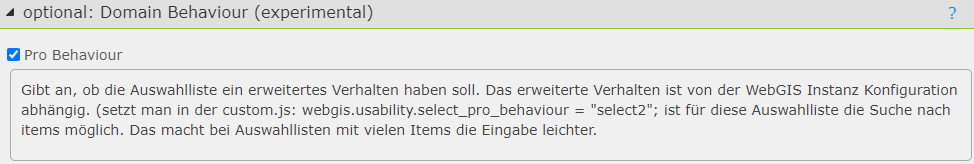
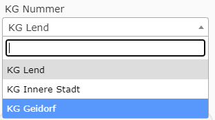

.. _cms-fields-domain-behaviour:

Changing Domain Behavior
========================

Domain fields are shown in the edit form as an HTML ``<SELECT>`` element.
The behavior of these fields can be changed in the CMS via the ``optional: Domain Behaviour (experimental)``
option. This option is only available if the field is defined as a domain:

The ``Pro`` option changes the behavior of the selection list so that it is shown as *select2*.
This provides a better user experience, since *select2* offers advanced features
such as search functions:

.. note::

    For the *select2* behavior to work, the *select2* library must be included
    in the viewer. This happens by default if the ``webgis.usability.select_pro_behaviour``
    constant is set in ``custom.js``:

    .. code:: javascript

       ``webgis.usability.select_pro_behaviour = true;``

    :ref:`Selection Lists Pro Behavior (custom.js) <customjs-domain-pro-behaviour>`.
