Selection Lists from Web Services (DataLinq)
============================================

*DataLinq* is part of the *WebGIS API* and is mainly used to create reports based on various data sources.
In addition, parameterized queries can be retrieved as JSON via a REST interface. This REST interface
can also be used as a source for **selection lists**.

Advantages over Other Sources
----------------------------------

Compared to the methods shown previously, there is no need here to specify a
*connection string* or an *SQL statement* for each selection list.
This has several advantages:
✅ The CMS parameterization remains **free of connection settings and database passwords**.
✅ A list defined once can be **reused**.
✅ **Changes to the list take effect immediately** across all edit forms.

DataLinq can use various data sources as the basis for a REST interface:
- **Database queries**
- **WebGIS API queries** against map services parameterized via the *WebGIS CMS*
- **Simple (plain-text) lists**

In this example, a **plain-text list** is used.
A database is not required for this – similar to **static selection lists**,
but with the advantage that changes to the list **take effect directly**.

.. note::
   Basic knowledge of *DataLinq* is assumed in this section.

==================

Creating a DataLinq Endpoint
----------------------------

First, a new *DataLinq* endpoint is created:

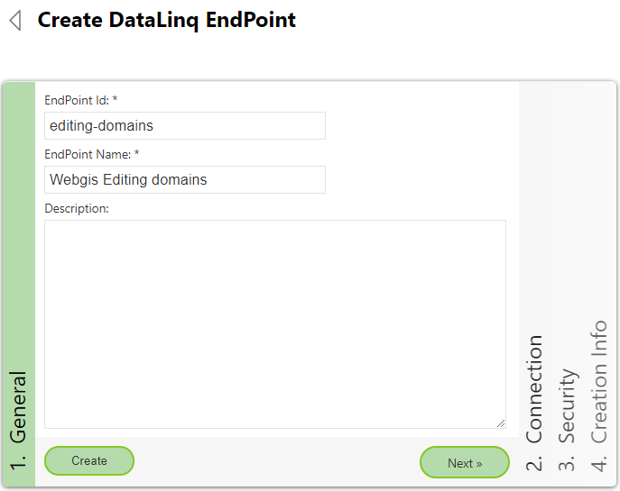

``PlainText`` is specified as the **type**. A *connection string* is not required for this type:

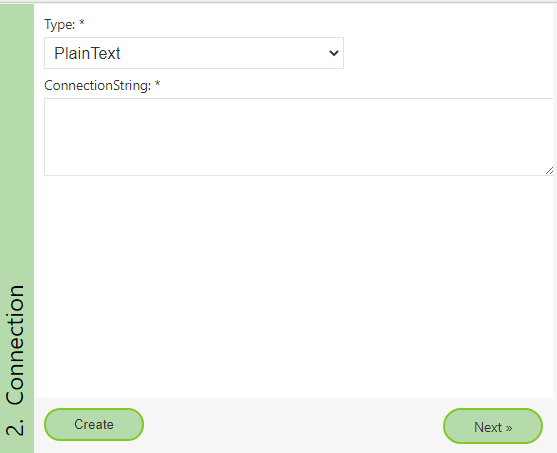

Under **Security**, the ``Reset`` buttons can be used to create new **access tokens**.
If the lists should **not be publicly accessible**, they must be protected.
If the client is not a user but an **application**, access is not via *user/password*,
but via **tokens**.

The client that retrieves the lists in this case is the **WebGIS application**:

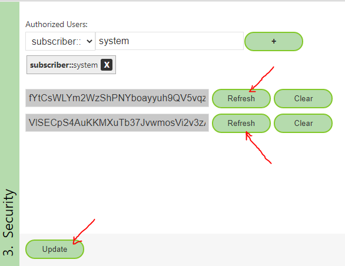

==================

Creating a DataLinq Query
-------------------------

In the next step, a **query** is created under the **endpoint**:

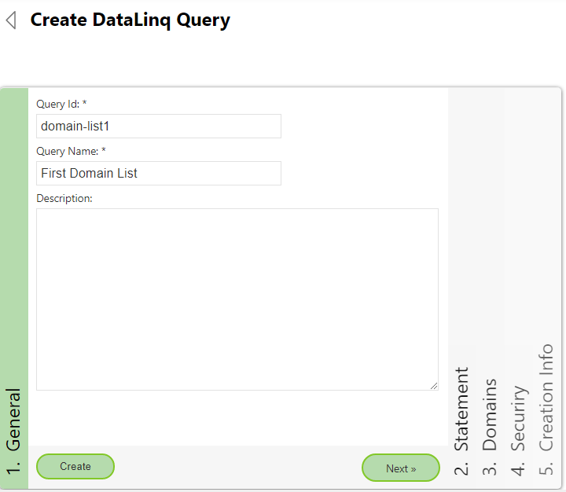

Then the editor can be opened under **Statement**:

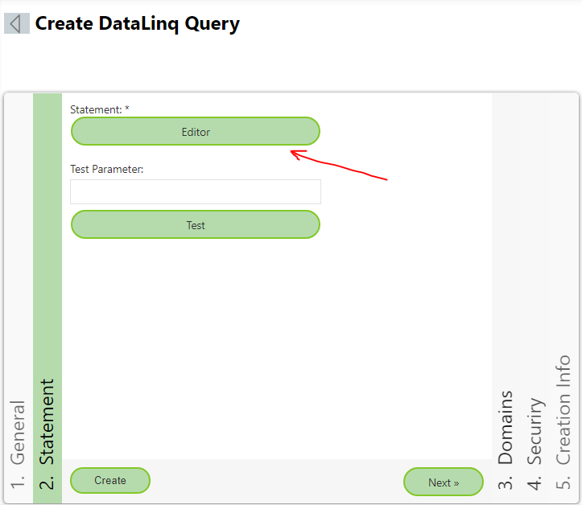

If the data source is a **database**, an **SQL statement** can be stored here.
For the **PlainText** type, the values for the list are entered **directly as text**:

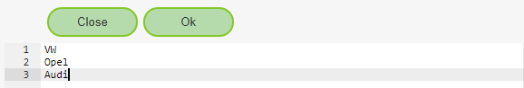

Formatting the Values
----------------------

- Each line corresponds to an **entry** in the selection list.
- The value is used both as the **"value"** and as the **"label"** (display name).
- If **"value"** and **"label"** should differ, they are separated with ``:``:

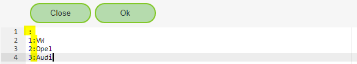

.. note::
   - A line with only a ``:`` adds an **empty option** to the selection list.
   - If the value **"0"** should be stored for empty values in the geodatabase, you can enter ``0:``.
   - **Empty lines are ignored.**

After entering the values, close the editor with **"Close"** and switch to the **Security area**.
The user ``*`` should be added here.
This means that any client that has access to the *endpoint* can also retrieve the query.

The permissions could be further restricted – for this example, however, it is enough
to secure the *endpoint*:

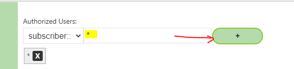

Finally, the query is created with **"Create"**.

==================

Testing the Query
-----------------

To test it, the query dialog can be opened:
**Statement → Test**

The result should look as follows:

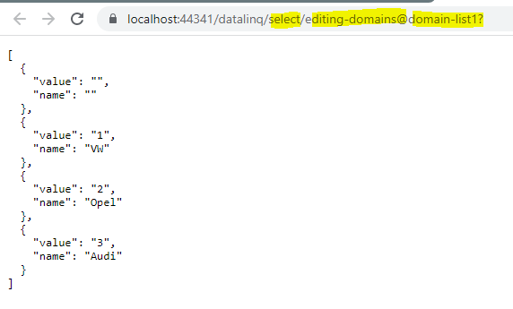

If the link is opened in **another browser or an incognito window**, an error message appears:

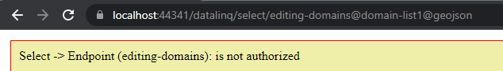

This is because access to the *endpoint* is **not public**.
For the client to be able to access the query later, one of the previously created **tokens** must be passed.

There are two valid methods for this:

``http://...../datalinq/select/endpoint(ENDPOINT-TOKEN)@query(QUERY-TOKEN)``
``http://...../datalinq/select/endpoint@query?endpoint_token=ENDPOINT_TOKEN&query_token=QUERY_TOKEN``

Since only **endpoint tokens** were defined in this example, the URL can be adjusted accordingly.
The query then also works in an *incognito window*:

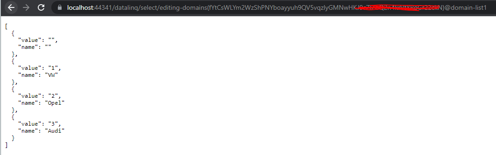

This link must then be entered into the **CMS**.

.. note::
   It does not matter which of the two tokens is used.
   **Both tokens are equivalent.**
   The reason for having two separate tokens is that a **seamless switch** between them remains possible later.

==================

Integrating the Selection List in the CMS
-----------------------------------------

For the respective **domain field** (edit form), the link to the query is entered under **ConnectionString**:

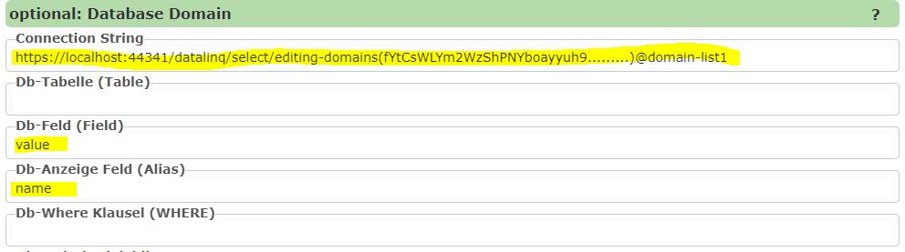

.. note::
   - Since the WebGIS application **cannot log in to** *DataLinq* **with a user/password**, a **token** must be specified here.
   - In principle, any **web service** that returns a **JSON array** can be used here.
   - The array must contain objects with the **properties** ``value`` and ``name``.
   - If different property names are used, these can be specified via ``DB field`` and ``DB display field``.
   - In this example, the values **already match the default values**, so they can be left empty.

==================

Cascading Selection Lists
---------------------------

Selection lists can also be made dependent on a **parent list**.
For the ``PlainText`` type, this is implemented via **indentation (2 spaces)**:

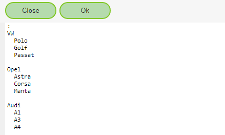

If the query is called without parameters, the **list with all makes** is returned:

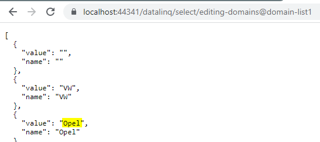

If only a specific **make** should be filtered, the parameter ``level0={value}`` can be passed:

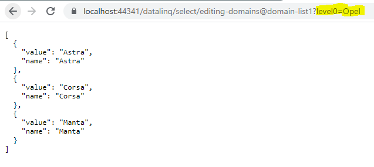

.. note::
   - **Further indentation** allows **any number of levels** to be defined.
   - Filtering is then done via the URL with parameters:

     ``level0={value0}&level1={value1}&level2={value2}``

In the **CMS**, the restriction can be defined via the **"DB Where Clause"**:

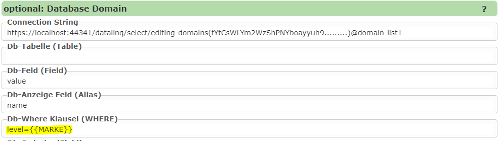

.. note::
   Here, ``MARKE`` is the **database field** into which the make is written via the selection list.
