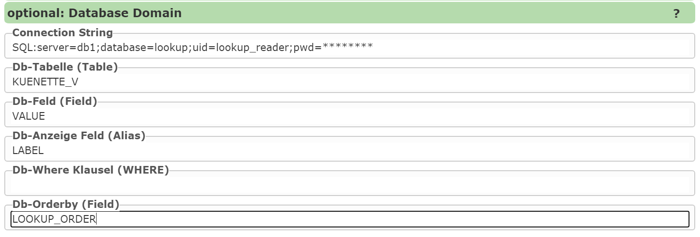
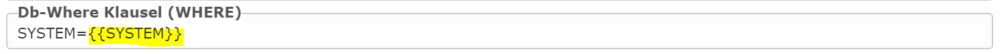

Selection List from a Database
------------------------------

To create a **selection list from a database**, a **connection string** to the database must first be defined.
The prefix ``SQL:`` indicates that this is an **SQL Server** database.

The following parameters are then set:

- **Table (or view):** The data source from which the values for the selection list come.
- **Db field:** The column that contains the **value** of a list entry.
  - When a selection is made, this value is stored in the **geodatabase**.
- **Db display field:** The column that shows the user the **display name** (*label*).
  - This column can be identical to *Db field*.
  - If the stored values are not descriptive, an alternative, more understandable column can be specified here.

Additionally, the following **optional settings** can be made:
✅ **Where condition:** Restricting the values via an SQL filter.
✅ **Sort column:** Defining the sort order of the values.

==================

Dynamic Dependencies Between Selection Lists
------------------------------------------------

Normally, selection lists are filled by the **map viewer** when the **input form** is created.
However, there are use cases where the content is only defined later – for example, when a
list is **dependent on another selection list**.

**Example:**
- Only once the user makes a selection in **list A** should **list B** be filtered accordingly.

To enable such dependencies, **placeholders** can be used in the **where condition**:

In this example, ``SYSTEM`` is an input field with a **selection list**.
If the selection there changes, the dependent selection list is also **automatically updated**.
The dependency arises from the placeholder:

``WHERE ... = '{{SYSTEM}}'``

==================

Further Placeholder Options
---------------------------------

Additionally, **role parameters** can also be used to further restrict lists.
An example of this is:

``{{role-parameter:gemnr,GEM_NR like '{0}'}}``

Here, a user's **role parameter "gemnr"** would be used to **dynamically filter the selection list**.
The possibilities offered by **role parameters** are explained in more detail in the **whitepaper "Extended Role Parameters"**.
