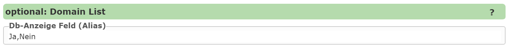

Static Selection Lists
-----------------------

For simple selection lists with few values, these can also be defined **statically** in the CMS.
The entries are simply specified in the text field with a **comma** as the separator.

It is also possible to distinguish between **value** and **display**.
In this case, **value** and **display** are separated by a **semicolon**.
The separator between the individual selection-list entries remains a **comma**:

``1:Ja,0:Nein``
