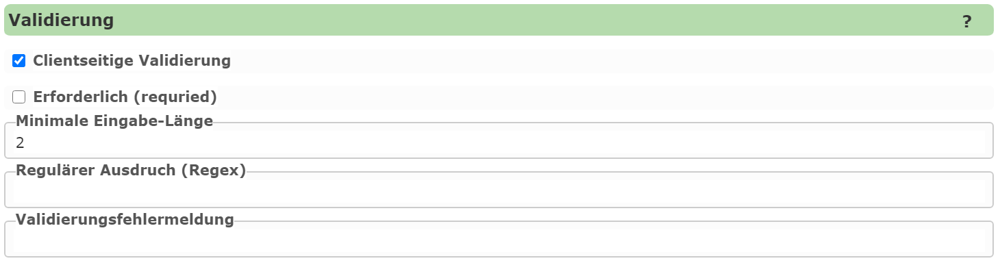

Editable Fields: Validation
===============================

This section specifies whether a field should be checked against certain criteria before a geo-object is saved.
If one of the criteria is not met, the user receives an error message, and the object cannot be saved.

The following criteria are possible:

* **Required:** A value must be entered for this field.
* **Minimum length:** The input must be at least a certain number of characters long.
* **Regular expression:** The input must match a defined regular expression.

**Regular expressions** can also be used to check more complex inputs, such as a valid email address.
If an error occurs, the user receives an error message. If this should not be the default error message,
the text can be adjusted under ``Validation error message``.
When using **regular expressions**, it is recommended to give the user examples of valid input.

Client-side Validation
-------------------------

Validation is performed on the server before saving, and prevents incorrect input from being stored in the geodatabase.
However, a better **user experience** results if input is already checked on the client (in the browser) while it is being entered.
The user then sees immediately if an input does not match the desired expression – without first having to click "Save".

To enable **client-side validation**, the corresponding option must be enabled.
