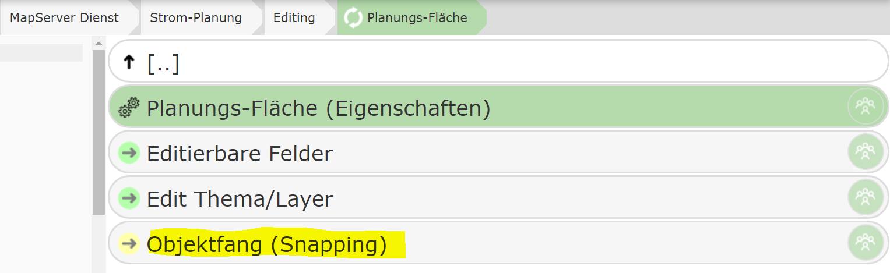
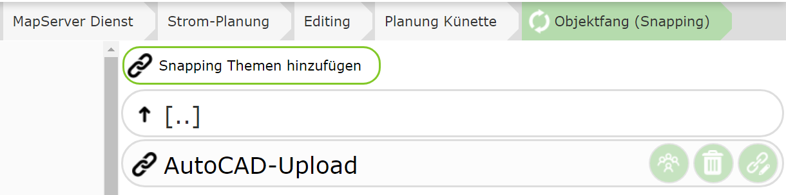
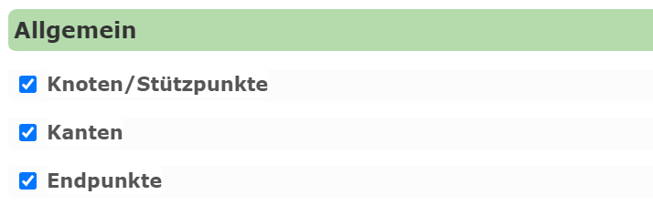

Snapping Settings
===================================

Snapping is essential for accurately constructing geo-objects. In this process, the drawing cursor is *snapped*
to certain objects when it is near them. Any number of *snapping schemas* can be created for each service,
which in turn can contain multiple topics.
It is possible to *snap* to vertices and edges.

The user is generally responsible for choosing the correct snapping topic.
If *snapping* is mandatory during editing, or if the snapping topic differs depending on the edit theme,
it is recommended to specify *snapping topics* automatically.

This is done under a specific node. The snapping topics specified here are automatically applied when the user
sets up an edit theme:

In the settings, you can also specify which snapping options are automatically set for this topic:

